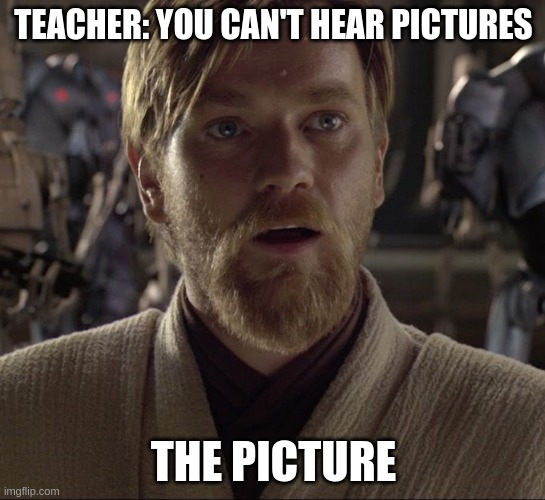

# Madness, Memes and Memory Hierarchies

<figure markdown>
{ width="600" }
</figure>

You've found a guide for learning about all the stuff needed to either program or reason about data-oriented
and real-time systems. It will help you with things like what memory allocations are, why using computational graphs
to program neural networks are a good idea, different concepts in parallelization of code, what types are,
and how to create real-time systems. All of it will run on your laptop!

To make things more complicated, because everyone loves complicated, there are some sections which are meant to
tailor to you, the reader! These specialization sections could for example have one set of tasks for people
interested in compute graphics and a different set of tasks for people interested in deep learning.
These sections are indicated by this DNA emoji - 🧬. You will find additional sections marked with 👨🏼‍💻.
These sections are meant as exercises or hand-ins for a course or if you want to explore the concepts
in practice. I make frequent references to the following concepts [deep learning][4], [computer graphics][3],
[ray/path tracing][1], [computer vision][5], [gpus][2] and other numerically based non-sense. Click any of the links
for a spiffy video which should give you a quick introduction.

I did a [prototype course][0] based on an earlier version of this website. The material
was being written during the course, so I wouldn't follow everything 1-to-1.

The material comprising the guide is divided into 7 modules.

* Motivation and tools, Rust and wgpu.
* Memory hierarchies, GPUs and computational graphs
* Concurrency and parallelism
* Types, energy usage, bit tricks and compression
* Aspects of real time systems and additional components to use for your own projects
* Optimization with tips on profiling
* Project ideas for trying out the various tools you have learned throughout the material

None of these chapters go into such depth that you will be an expert, but the breadth of topics will
hopefully inform you of some of the many unknown unknowns that are out there. You will learn a basic set of skills
which will be enough to think creatively and proactively about computing. Hopefully, you'll see the fun of it
and this is just the beginning of a new journey for you. 

I have tried to make the website as fun and light as possible, but to be honest...
I may have gone overboard with the memes. The website is slowly becoming more like a collection of
programming memes with some light educational content around it.

Without further ado, let's get this show on the road!

_________________

## Contributions
I don't have much time to work on this anymore, so issues, pull requests and updates to the code are very welcome. If you find a glitch, typo or bug, please
help! Feedback about sections you didn't understand is also welcome!
You are also very VERY welcome to submit more project templates to help others jump past the initial setup and get to the fun of adding their own
contents and profiling the project. In fact, unless you don't want me to, I would be more than happy to credit you by name!

To build and show the documents just run the following from root.

```bash
pip install -r requirements.txt
mkdocs serve
```

## License
The content of this course is free to use under the Apache 2.0 license, but using it for machine learning
is not allowed. No bueno!

If you use parts of this course in your work, please cite using:

```bibtex
@misc{absorensen_numbers_go_brrrr,
    author       = {Anders Bo Sørensen},
    title        = {Numbers Go Brrr},
    howpublished = {\url{https://github.com/absorensen/numbers_go_brrrr}},
    year         = {2023-2025}
}
```

[0]: https://absorensen.github.io/real-time-visual-and-machine-learning-systems/
[1]: https://www.youtube.com/watch?v=iOlehM5kNSk
[2]: https://www.youtube.com/watch?v=h9Z4oGN89MU
[3]: https://www.youtube.com/watch?v=C8YtdC8mxTU&t=1125s
[4]: https://www.youtube.com/watch?v=aircAruvnKk
[5]: https://www.youtube.com/watch?v=-4E2-0sxVUM
