# Intro to GPU's
GPU's are fairly ubiquitous at this point. They started off as purely for graphics, but
around 2008, enough researchers had tinkered with workarounds to use them for general
computing that Nvidia put out CUDA, opening up GPU's for more general usage. GPU's still do lots
of graphics, but the opaque black box parts are increasingly opened and even graphics API's such as OpenGL,
Vulkan, Metal and DirectX have opened up. With modern graphics API's you don't even necessarily need
a graphics output to use them. You can just use the pure compute capabilities. This guide won't get
into graphics, except for the sections specialized for graphics of course.

Ok, so anyways, GPU's are pretty hot stuff right now as the software support becomes deeper and deeper,
the hardware increasingly has hardware support for specific operations in deep learning, ray tracing and
optical flow, and deep learning has hit the mainstream in a big way.

You can think of the GPU as an expansion of the memory hierarchies we examined earlier.
It is not running in lock step with the CPU, and you have to program more things explicitly, while
also changing your mindset about how programming works. Memory transfers to and from the CPU and GPU will be
relatively explicit, you have explicit control of a part of the L1 cache (on Nvidia architectures at least),
you have to start programming in a work group oriented fashion and if-statements become quite dangerous.

If the CPU, with its numerous cores is like a team of highly skilled specialists building a car, sure,
they can build an amazing car, they can adapt to changing circumstances quite well, they can act independently,
then the GPU is like a factory. Each path and process has to be carefully optimized, they might each only deal with
a very small piece of the process each and people have to work in lockstep. But. Their throughput is unmatched.

I will go into more detail as to how to actually write GPU code, but the guide is set up using
Rust and a GPU API abstraction layer called [wgpu](https://wgpu.rs/). You don't need to understand how it works
right now, but it means that you should be able to run all code, including GPU code, on your platform, no matter
whether it's made by Apple, Nvidia, AMD or Intel.

In general, I will be using terminology specific to the compute part of the graphics API's and I will
keep to ```wgpu``` and ```wgsl``` terminology. You might see significant differences in terminology
if you follow up this guide while having previous ```CUDA``` programming experience. In terms of how the
hardware is designed, my knowledge is mainly based on Nvidia architecture.

## GPU Hardware
First off, when dealing with the GPU, you will have to manipulate the GPU from the CPU with commands
like "allocate this much memory", "transfer this memory from the CPU to GPU", "execute this shader/kernel" and
"synchronize". These are all done in whatever language you are writing in on the CPU side, except for the
actual program the GPU has to run. This is distinct for the GPU API, some GPU APIs even accept shaders
written in multiple shading languages, as they can either be transpiled (translated) from one language to
another, or they can be compiled to an intermediate representation, such as SPIR-V, which they can then ingest.
What actually happens is they have a compiler hidden behind the scenes and compile it to other representations.
Don't worry about that.

But once we have built up all of these commands, at least if they are non-blocking, as in the CPU program will
advance regardless of the command having completed, we have to actually submit them to the GPU. We do this with a
synchronization. The commands may/may not have already been submitted, but if you call a synchronization
function, the CPU-side code will block and wait until any and all submitted commands have executed on the GPU
and the GPU sends the all-clear signal in return. Imagine you are at a horse track. You have to give instructions
to a jockey on a race horse. You stand on the periphery of the big oval race track. You tell the jockey to make
some adjustment and do a lap. The horse first has to accelerate and then once it nears you, it slows down and you can
talk again. What would be more efficient was, if you could leave notes for the jockey to pick up
whenever he was coming around and the horse could just continue at speed. In some API's the GPU
can just be set in motion and then whenever you have a change to the loop it is running, adjust
or change. Or you can set work in motion and come back at a later time, checking whether the work might be done.

### Transfer
When transferring memory, you should have the following model in mind, nothing gets transferred without a staging
area. When transferring from CPU to GPU, at least in the CUDA programming model, it will pin an area in memory.
That memory won't be movable until it is unpinned. You basically transfer some memory from say, a vector you
want transferred to the GPU, to this pinned memory staging area. That pinned memory area means the GPU
can work in peace without interruptions and without risking that the memory can be deallocated before the transfer
is complete. Not doing this could result in reading from memory which does not belong to our program.
In CUDA, if you don't explicitly do it, CUDA will create a pinned memory area and do it for you. If you do it
yourself and optimize this process you are likely to see around 2x improvement in transfer speed. The same
thing happens on the GPU, a staging area visible to the CPU is where the transferred
memory is stored, and then moved from the controlled area to the rest of GPU memory, where the GPU is free to do
what it wants with it, without interruptions and guarantees.

### Threads, Work Groups and Blocks
Threads are sort of like a CPU core, except a CPU core is a physical entity, whereas a thread is more like
a set of variables (think back to the stack and function calls) which is following its own set of instructions.
Thread 1 could be running program A with various states in registers and local variables X. It makes a call
to something expensive, like a cache-missing memory access. While waiting, thread 1 is swapped for thread 2.
Its state is of course saved, but thread 2's program B and state Y are swapped in for it to do some work.
This keeps the CPU core itself occupied with work.

Threads on a GPU, will usually be executing the SAME program, unless several calls are overlapped, but let's
just focus on you having called a single operation. In that case all of your threads will launch, running
the same program. They might however, go down different branches (think if-statements!), but this is more expensive
on the GPU than the CPU, and should in general be avoided as much as possible. Each thread will have its own local
variables. Threads on a GPU are launched in groups. Depending on the platform and the API they will be
called something different. In wgpu, which is what we will be using, it is called a work group, while
in CUDA terminology it is called a warp. On Nvidia GPUs it will be at most 32 threads per work group
and on AMD it will be at most 64 threads. The "at most" might seem a bit weird, but there is something called
register pressure. All of the execution units that can run those 32 or 64 threads at the same time, share
a lot of the same physical memory, so if your program uses lots of memory, you might have to decrease
the amount of threads to have enough memory to run your program.

Anyways. Once you decided to write a matrix multiplication shader, you need to figure out which threads
are gonna go where. In that case, I would begin by launching 1 thread for every output element.

When programming for a GPU you have some maximum amount of threads you can launch. This is usually
defined in three dimensions. Yes! You define how many threads to launch in three dimensions. It doesn't
actually have much of an effect, but it makes sense to tailor how you launch threads to the shape of your
problem. If you are performing image processing or matrix multiplication, by all means, launch a 2D grid.
If you are summing an abitrary list of numbers, a single dimension will probably suffice.

So, we should launch a 2D grid, matching the output elements of our problem. Next up,
how do know which thread does what work? Each thread will usually begin its program
by asking built-in variables which ID it has. This can be which thread it is within its
own workgroup, or it could be globally. Once it knows that, it should usually check whether
it is within legal bounds of the problem. We almost always want n^2 threads in our workgroup,
and it wouldn't be very flexible if the problem size always had to match exactly.
So usually, you should launch too many threads and then have an if-statement following
the thread ID calculation. If within acceptable range, do work, otherwise, don't do work.

It cannot be assumed that all work groups are running at the same time. The GPU might need to launch
waves of work groups because there aren't enough physical execution units. As such, we can only
synchronize between threads inside the warp. Some GPU's, especially very recent ones actually support
synchronization further out in the hierarchy than a work group.

### GPU Memory Hierarchy
The memory hierarchy on a GPU looks a lot like the memory hierarchy on the CPU. Here it is exemplified by the
Nvidia H100, which is a very expensive data center GPU and most definitely not the one residing in your laptop.
But the bandwidth (how much data per second can be transferred) internally on the card is a lot higher than on the CPU.
All of the streaming multiprocessors share the L2 cache and each streaming multiprocessor shares an L1 cache. On
Nvidia GPU's the streaming multiprocessor is a number of, in this case 4, units which can each execute a
work group, or in Nvidia terminology, a warp.

<figure markdown>
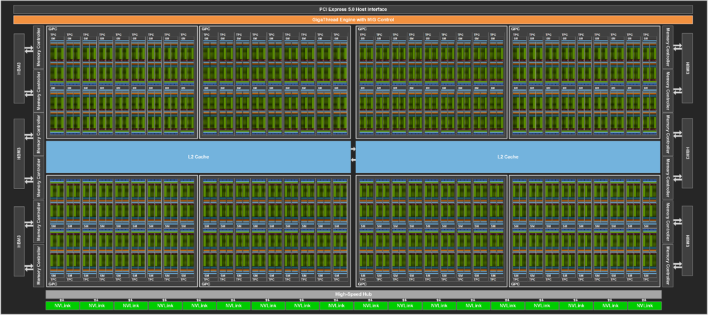{ width="700" }
<figcaption>
The layout of a H100 GPU. Note that connectivity to the memory (HBM3) is on the left and right sides.
<a href="https://developer.nvidia.com/blog/nvidia-hopper-architecture-in-depth/">
Image credit </a>
</figcaption>
</figure>

Take some time to study these two diagrams and think about how data moves first from the CPU,
to the GPU's main memory, then to the L2 cache, then to the streaming multiprocessor which needs its L1 cache
until it finally is loaded up into the registers of the 32x4 threads executing on different, but adjacent, segments
of the same data.

<figure markdown>
{ width="400" }
<figcaption>
The layout of a single Streaming Multiprocessor. It can execute 4 work groups or warps at a time.
<a href="https://developer.nvidia.com/blog/nvidia-hopper-architecture-in-depth/">
Image credit </a>
</figcaption>
</figure>

The threads accumulate their data into their own registers until they are done and write the
result to main memory. The CPU waits for the GPU to be finished, until the GPU is, transfers to the CPU and
signals that it is finished.

It's not always as clear cut, though. If you are using a laptop, you probably have an integrated graphics card.
The CPU and GPU coexist and share the same memory. There may be sections where there is higher bandwidth than
just normal CPU-based memory, but overall the integrated GPU has access to the same memory the CPU has.
This makes for faster transfers, but probably slower overall computation. This has become quite useful
recently with as most consumer grade GPU's have around 8 GB of memory, maybe slightly more, but your computer should
at least have 16 GB of RAM. Buying more and upgrading, a desktop at least, is quite easy. This can allow you to
run neural networks locally, even if your GPU isn't big enough to fit everything needed.
A desktop GPU with more than 16GB of RAM would probably still outperform an integrated graphics card with 16GB
of RAM available, but it would be very expensive.

_________________

## Introducing wgpu and wgsl
I will for all GPU purposes make use of the graphics library wgpu, but only the compute parts.
wgpu is based on the WebGPU spec, which is supposed to be the new GPU API for your browser, as well as not
being particularly creative with their naming, the actual support in browsers for WebGPU is not great, but definitely
progressing. For most systems, especially if you aren't actually running in a browser, wgpu
will default to using different, more powerful backends. For example, at the time of writing this,
I am using an HP laptop, with an Intel integrated graphics card running Windows 10. Whenver I run a program
with wgpu, wgpu tells me it has chosen Vulkan as my current backend. We could of course just write Vulkan,
but it would be a bit more complicated, as Vulkan is slightly more low-level than wgpu, but it would also
be more powerful. But attaining ultimate performance isn't the purpose of this guide. It's to get as many
people as possible started as soon as possible. It has to run on an Apple computer and it has to be easy to
install. So, wgpu it is. While any API which has to cover as many platforms as wgpu does will usually be hampered
by the lowest common denominator, it is possible to query wgpu for hardware support for various features, such
as fp16 support.

The default shading language (the language you use to write the code the GPU will run) is wgsl, which
was defined along with the WebGPU specification. It is possible to use other shading languages, such
as glsl, hlsl, Slang or rust-gpu, which also have more info and general documentation, but because of the increased code
complexity in building the files to SPIR-V and then ingesting the SPIR-V, I elected to just use what was simplest.

We can add wgpu to a project by going into the ```Cargo.toml``` file in the root directory,
and under ```[dependencies]``` write the line ```wgpu = "*"```. It will pull down the latest version of wgpu.
You can of course also get a specific version of it, such as ```wgpu = "0.16.3"```.

## Basic GPU Programming
GPU programming, as has previously been mentioned, has two major elements. Host (CPU) code and device (GPU)
code. We'll start off with the basics of the host code and then move on the device code. Just enough
for you to be able to read the following sections and understand what is going on in this entire module,
as it doesn't go into the finer details of GPU programming, but is centered around a GPU-oriented paradigm.

The rest of this section will be make use of the code location at ```m1_memory_hierarchies::code::gpu_add``` or
[online][12].
Make sure to go and actually read the code. It is full of comments! And they're made just for you!
If you want to learn more about wgpu you can visit [Learn Wgpu][13].

Be sure to read through the code! Do this before you read the rest of this section, which will go into greater
detail.

Starting in the ```main``` function, first we initialize the environment logger with ```env_logger::init()```.
This will get us more helpful feedback from wgpu. This should only happen once in your code, so by putting it
as the very first line, we should be sure that it shouldn't need to happen anywhere else.

Next up, we call ```pollster::block_on(self_test())```. The ```self_test``` function, is a function I made, and
use elsewhere to make sure your system is compatible and to print the system info so you can see what GPU is being
found and what backend is being used. ```pollster::block_on``` allows us to call asynchronous code from a normal
function. If you don't remember what asynchronous means, just think of it as being non-blocking. Meaning, we can
launch an asynchronous function and just continue on to the next line of code. But the way we do this is different
depending on whether we are inside a normal function or an ```async``` function. An ```async``` function definition
example - ```pub async fn self_test() -> bool {```.

If we are in a normal function and we call an ```async``` function, we have to wait for it to complete. As in, block
on the function call, which is of course ```pollster::block_on()```. Inside the ```async``` function itself it can
either block on async function calls by using ```await``` - such as ```let result = async_function().await;``` or
you can store what is known as a future. We could set in motion the loading of a number of files, and then once we
were done and actually genuinely NEEDED to use the files for something, ```await``` on the futures. The ```async```
function, when called from a normal function also returns a future, but we can't use ```.await``` on it.

=== "Rust"

    ```rust
    pub async fn load_four_files(path_a: &str, path_b: &str, path_c: &str, path_d: &str) -> (File, File, File, File) {
        let file_future_a = load_file_async(path_a);
        let file_future_b = load_file_async(path_b);
        let file_future_c = load_file_async(path_c);
        let file_future_d = load_file_async(path_d);

        let file_a = file_future_a.await; // Block on the future
        let file_b = file_future_b.await;
        let file_c = file_future_c.await;
        let file_d = file_future_d.await;

        (file_a, file_b, file_c, file_d)
    }
    ```

Ok, so why do we need ```async``` when dealing with the GPU? In some cases, we don't care about synchronization.
We just want to keep transferring data to the GPU as fast as we can get it, the GPU might output to the display
or we might get some data transferred back, but if we are doing this in a real-time setting, we might not care
to synchronize, as in block, and we just need things when they are ready. Anything to do with wgpu - ```async```
will be involved. At least in Rust.

Let's move on. We set up our CPU-side data. This is a simple vector addition, and I elected to make the data
in a way that was easily verifiable as correct for humans. Input A and B are just vectors of 32-bit floats
with values equal to their index. The correct result in the output vector should of course be approximately double
the index value then.

Finally, we call ```initialize_gpu()``` and block on it. Let's go into that function!

First we get an ```Instance```. The ```Instance``` is a wgpu context which we will use to get ```Adapter``` and
```Surface```. The ```Adapter``` corresponds to your GPU. We specifically request the adapter with high performance.
If you are on a system with more than one GPU, such as a laptop with an integrated GPU, which shares memory with
the CPU, and a more powerful dedicated GPU, it should try to get access to the dedicated GPU. We also request
```None``` for ```compatible_surface```. Surfaces are what you would render to if you were doing graphics. Think
of an image which you could show on your display. If we don't need to do graphics, not having one
is less work. It also means we can run on data center GPU's, which might not even have a display port. So we just
get the ```Adapter```. We use the ```Adapter``` to get ```Device```, which will be our handle to the GPU
from now on. Whereas the ```Adapter``` is more of a raw connection, which we can't do much with. The
```Device``` is a handle that has some guaranteed features. The ```Adapter``` tells us what features we can get.
Once those features are guaranteed, it is much easier for wgpu to open up for more functionality with
the ```Device```. We actually don't need the ```Adapter``` after we get the device,
but I keep it around in the GPUHandles for you to tinker around with auto-complete to see what it can
do. We do need the ```Device``` though. We also need the ```Queue```. The ```Queue``` is where we
can submit the work we want the GPU to do.

Note that when defining our ```DeviceDescriptor``` for getting a ```Device``` that lives up to our needs
our current requested ```features``` is ```wgpu::Features::empty()```. We just want the absolute basics.
But we could request, or at least see whether we could get them, features like 16-bit floating point support.

Now back to the ```main``` function!

We now have our bundled GPU-related handles. Now we calculate how many threads we need to launch for our
problem size. ```let element_count: usize = 100;```, so we need to launch AT LEAST 100 threads if each thread
only processes one element of our problem. Which it does, in our simplified case. Given that we would like to fill
up our work groups, I have elected to use 32 threads per work group. ```let block_size: usize = 32;```.
Given that the register pressure is likely very low for our shader, this should be no problem. Finally, we
calculate how many blocks to launch. This simple calculation is found all over the place when doing
GPGPU programming. ```let launch_blocks: u32 = ((element_count + block_size - 1) / block_size) as u32;```.
The basic premise is that we add one element less than the full work group size and then use integer division
to make sure we always have at least as many threads as we need. In the worst case of a work group size of 32,
we will have a work group at the very end of the vectors with 31 idle threads.

Next up, we compile our shader code ```add_vectors.wgsl``` with ```.create_shader_module()```.
Compiling shaders is quite expensive, so if you are programming a bigger system than this, you might want to
save the compiled code or do it as part of your build step.
When running you can load it from disk as needed. Once we have compiled
our shader code we can create a compute pipeline with a specific entry point. The entry point is just the function
that will be called when dispatching the shader call later on. Once we have a ```ComputePipeline``` we can
begin doing our bind group layouts. In CUDA, you can pass device side pointers to your CUDA functions
when dispatching. Or phrased differently, when using CUDA you can pass along memory addresses for buffers you have
explicitly allocated on the GPU. When using the graphics APIs the most basic thing to do, if you are
not going bindless, which is... well, don't worry about it, is to use bindings. There is a certain amount of bind
slots available in a shader depending on the API and perhaps the system. What can be a bit tricky is the binding
slot you declare on the CPU for buffer X, has to match the exact binding slot in the shader. E.g. if you bound
your input buffer to binding slot 0 on the CPU, it has to be bound to binding slot 0 in your shader code.
Additionally, the compiler will complain if you don't use that buffer in the shader. Finally, you can have multiple
sets of bindings in the same shader. These are called bind groups and each has N binding slots.

When I created the ```GPUVector```s earlier, the ```new``` function allocated a storage buffer, which is visible
to the shader and transferred the contents of the given vector to the GPU. This can be done more effectively, but
it's a nice and easy way to start things off. We don't have to keep track of whether we remembered to transfer
our data to the GPU or not, which makes sure we don't use uninitialized data. In the case of the output vector, we
have also allocated a ```staging_buffer``` to more explicitly transfer data back to the CPU. This ```Buffer```
has also been flagged as readable from the CPU.

The ```storage_buffer```s we have created, when creating the ```GPUVector```s from before, can be bound. I
add these binding references to a vector and send them to a convenience function ```create_bind_group()```, which
binds the array of bindings in order. Do note that we don't specify what can and cannot be done at this step. It
was specified at the creation of the ```storage_buffer```s and it will be specificed locally in the binding of
the buffers in the shader.

Once we have our bindings set up, we create a ```CommandEncoder```, which we get from ```Device```.
The command encoder is a buffer of commands. We can add stuff like render and compute operations,
they are sort of like a collection of operations and state, and transfer operations. The command encoder
needs to be finished, before it is submitted to the queue. Remember the ```Queue``` we got earlier?
This is what it was for. We submit finished ```CommandEncoder```s to our ```Queue```, which submits
the jobs to the GPU. For this specific program we add two commands to the ```CommandEncoder```. We
dispatch our compute shader, enclosed in a ```ComputePass``` and launch the appropriate number of threads.
Note also the ```label``` field. This field permeates wgpu usage. It is mostly for debugging. It helps us
identify what is causing an issue. Once we have finished our ```ComputePass```,
due to it going out of scope, we add a transfer operation. We use the ```staging_buffer``` on our ```output```
vector, to read the output back to the CPU. Then we finish our ```CommandEncoder``` and submit it
to the ```Queue```.

We then setup a ```oneshot_channel```. Don't worry too much about this. It is a connection which can only be used
for sending data once. We map the ```staging_buffer``` and send its data using the sender/receiver pair. Once
we have done this ```map_async``` call, we wait for the GPU to be finish all operations currently in its queue.
Once it has finished we block on the receiver. Until the receiver sends the ```Ok``` signal, we wait. Once we get
it we retrieve the data. This is raw data in bytes, ```u8```, which we recast to the type we know it is, which in
this case is ```f32```. We do a bit of clean up, and don't you know it, that's the program!

<figure markdown>
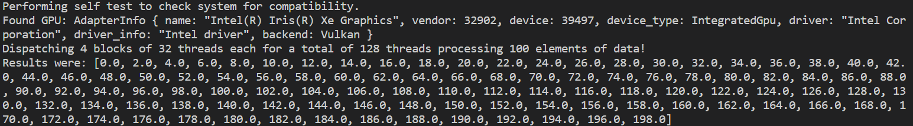{ width="600" }
<figcaption>
Adding our two vectors, it should be easily verifiable that it is correct.
</figcaption>
</figure>

Maybe now might be a good time to go back to the code and try to run through it again on your own.

## Remove the loop where, you say?
When writing GPU programs, you should usually start writing a CPU-based version. Once that works, you have
something to verify your GPU program against. Often the part of your program that you want to offload to the GPU,
will have loops. For example, in a vector addition snippet you might have -

=== "Rust"

    ```rust
    for index in 0..ouput.len() {
        output[index] = input_a[index] + input_b[index];
    }
    ```

When transferring your program to a GPU shader, as a way to get comfortable with thinking about this sort of
parallelism, you should start with writing a single threaded version on the GPU. You can do this by dispatching
a single thread ```cpass.dispatch_workgroups(1, 1, 1);```. It WILL be slower than the CPU
version, but it allows you to get all of the transfers and synchronizations out of the way first. Once you have
done that, and you have verified that it works, mind you, you can start adding, or rather removing dimensions.
You do that by removing one of the for-loops in your code and replacing it with added dimensionality in your shader
dispatch. So in your first version of your vector addition shader, it might look like this sketch (don't know if
it compiles) -

=== "WGSL"

    ```rust
    @compute @workgroup_size(32, 1, 1) 
    fn main(@builtin(global_invocation_id) global_id: vec3<u32>) {
        let thread_id: u32 = global_id.x;
        
        if (thread_id < 1) {
            for (var index: u32 = 0u; index < dimensions.element_count; index += 1u) { 
                output[index] = input_a[index] + input_b[index];
            }
        }
    }
    ```

When that works, you can begin thinking about how to remove that pesky loop. You do that by removing a dimension
in your shader, but adding one in your dispatch and then making accomodations in your shader. We can take that
and transform it by instead dispatching more 1D threads: ```cpass.dispatch_workgroups(launch_blocks, 1, 1);```.
Then we change the shader to have each thread work on a single element -

=== "WGSL"

    ```rust
    @compute @workgroup_size(32, 1, 1) 
    fn main(@builtin(global_invocation_id) global_id: vec3<u32>) {
        let thread_id: u32 = global_id.x;
        
        if (thread_id < dimensions.element_count) {
            output[thread_id] = input_a[thread_id] + input_b[thread_id];        
        }
    }
    ```

If there had been more dimensions, we could have continued expanding and removing dimensionality. We can continue
until the third dimension, usually you can launch less work groups in the third dimension than in the first two. You
also have to remember to check whether the thread is outside of the valid range for each dimension. You
should always look up your graphics cards and GPU API to see how many threads you can launch. You might have to
break it into several passes. It's not actually quite this simple, as, well you remember how we learned stride
had a negative impact on performance earlier? Well, that is not quite the same on GPU's.

## Coalesced Accessing and Strides
Because of the way threads and work groups share memory on a GPU, and each thread executing the same line of
code at the same time, if thread A calls for memory at indices 0, 1, 2, 3 and thread B, which is right next to it
in the same work group, calls for indices 4, 5, 6, 7, they will be asking for two different cache lines at the
same time. Imagine the whole work group doing this at the same time. They will all be waiting, while
requesting *different cache lines*. What is normally faster, if given a work group size of 32,
thread A calls for indices 0, 32, 64 and 96, with thread B calling for indices 1, 33, 65 and 97. This allows for
the work group to call for a minimum of cache lines in lock step and each thread getting a piece of each cache line.
This is called *coalesced accessing* and if you ever say that to a GPGPU programmer, you will see a faint smile on
their face. Think of a jigsaw puzzle, where the pieces are slowly being adjusted.
Eventually, they all snap into place. All of the pieces fit exactly right.

Here's a small example, if we for some reason were intent on turning our vector addition shader into
2D matrix addition, but we were deadset on keeping the thread grid for our dispatch one dimensional we
could do something like this -

=== "WGSL"

    ```rust
    const BLOCK_SIZE: u32 = 32u;
    @compute @workgroup_size(32, 1, 1) 
    fn main(@builtin(global_invocation_id) global_id: vec3<u32>) {
        let thread_id: u32 = global_id.x;
        
        if (thread_id < dimensions.first_dimension_count) {
            for (
                var index: u32 = thread_id; 
                index < dimensions.second_dimension_count; 
                index += BLOCK_SIZE
            ) { 
                output[index] = input_a[index] + input_b[index];
            }
        }
    }
    ```

Again, not verified/compiled code. But hold on for a second! We have to remember that there are other work groups
too. We can't necessarily just stride through the single dimension in the same way. We would be reprocessing
elements that had already been processed by a different work group. What we could do instead would be to step
along the rows instead.

=== "WGSL"

    ```rust
    @compute @workgroup_size(32, 1, 1) 
    fn main(@builtin(global_invocation_id) global_id: vec3<u32>) {
        let thread_id: u32 = global_id.x;
        
        if (thread_id < dimensions.first_dimension_count) {
            for (
                var index: u32 = thread_id; 
                index < dimensions.second_dimension_count; 
                index += dimensions.first_dimension_count
            ) { 
                output[index] = input_a[index] + input_b[index];
            }
        }
    }
    ```

In other cases, using a stride of the work group size can work as well. In this case, stepping along the rows
made better sense, but keep thinking in these terms, implement different versions and test them! It's the
only way to be sure! Once you have made a couple of different versions and done simple timing you can always
try using a profiler.

## Divergence, Overlap and Occupancy
One statement I tried to sweep under the rug in the last section was - "each thread in a work group executes
in lock step". It is highly desirable for a work group to have each thread executing in lock step. That is
each thread is executing the same line in your program. If you have branches, like if-statements, some
threads might execute path A and some threads might execute path B. This will lead to divergence. Divergence
will result in the group of threads A executing while group of threads B will wait until A is finished,
and then executed. Finally, they might join again.

<figure markdown>
{ width="700" }
<figcaption>
An if-statement causes a work group to diverge into two.
<a href="https://developer.nvidia.com/blog/using-cuda-warp-level-primitives/">
Image credit </a>
</figcaption>
</figure>

As you can imagine, this expands the timeline of executing the code compared to a non-diverging execution.
But if you were within a workgroup where all threads take the same branch there wouldn't be an issue.
Thankfully, some recent hardware takes less of a performance hit when work groups diverge. They take less
of a hit due to each thread havin their own program counter. The program counter is a variable keeping track
of which line of code is currently being executed. Thus the GPU no longer has to divide the work group
into execution paths. Now the individual threads might just be moving down different paths at the same time,
which is just bad performance. They could for example be sampling from different data, at which point we
are back at the whole "threads should maximally share cache lines" thing.

Once you have most of your work groups not diverging, are you sure your threads aren't just sitting around
waiting? Whenever a thread wants to load a piece of data all the way from memory, it can take quite a long
while to retrieve. If however, you have dispatched enough work, the threads waiting around for memory
can be swapped out for another work group which might be able to do some work, once this work group has time
for a nap, like when it is also requesting data from memory, the first work group can be swapped back in,
when the requested data has, hopefully, arrived. Without this overlap, GPU programs are likely to seem
a lot slower than they need to be. If however, you launch a lot more threads than there are physical
execution units, you are likely to see this overlap resulting in higher occupancy. The higher the occupancy
the more time a physical execution unit spends on doing actual work and not just stalling until everything
is ready. So you can either launch a lot of independent work, or use a lot of elements in your data.
Like really big matrices!

In machine learning terms, if you have pipelined and made your computational graph relatively independent,
you might see a big increase in occupancy by using fewer layers and make the ones left very wide.

## Shared Memory and Synchronization
Just two final pieces are missing before we go back to memory hierarchies. Shared memory and synchronization.
GPU's have more programmable pieces of the memory hiearchy, such as sharing directly between threads, sharing
between work groups and more, but I will just focus on the primitives for shared memory. Shared memory is a
programmable section of the L1 cache on Nvidia architectures. This might differ on other GPUs like Intel and AMD.
A cache miss, resulting in retrieving data all the way from memory, costs 100's of cycles. A rule of thumb used
to be around 250-300 cycles. Accessing data from shared memory costs around 10 cycles. This is very useful if
each piece of data is accessed more than once. It could for example be overlaps in convolutions or storing
preliminary results in shared memory for the work group to finally reduce the results internally in the
workgroup, before one of the threads writes the final result to global memory.

Typically when using shared memory, you will first see a section where each thread loads one or more pieces
of data into shared memory, followed by a synchronization primitive. This synchronization primitive
is available in wgsl and is called ```workgroupBarrier();```. It is available in most shader languages,
although it will likely be named something else. It is a barrier ensuring that all threads in the
workgroup will stall and wait until each thread has signalled that it is ready to proceed. This
is very handy when you are loading data into shared memory for reuse between the threads. A small
example snippet -

=== "WGSL"

    ```rust
    var<workgroup> shared_data: array<f32, BLOCK_SIZE>;

    @compute @workgroup_size(32, 1, 1) 
    fn workgroup_phase(
        @builtin(workgroup_id) group_id: vec3<u32>, 
        @builtin(local_invocation_id) local_id: vec3<u32>,
        ) {
        var tid: u32 = local_id.x;
        if (group_id.x == 0u) {
            // In this first section we can use all 32 threads
            var elements_left: u32 = sum_uniform.block_count;
            var i: u32 = tid;
            var sum_value: f32 = 0.0;
            // How do we handle the odd case?
            while (BLOCK_SIZE < elements_left) {
                sum_value += data[i];
                elements_left -= BLOCK_SIZE;
                i += BLOCK_SIZE;
            }
            if (0u < elements_left) {
                if(tid < elements_left) {
                    sum_value += data[i];
                }
            }

            shared_data[tid] = sum_value;
            workgroupBarrier();
        }
    ```

As usual, this code isn't very well tested and there might be some cases where it isn't fully functional,
but you can see the primitives for declaring shared memory, accessing it and synchronizing. When you start coding
with shared memory, you shouldn't necessarily be surprised that your code becomes a bit slower. If you are running
a 1D problem, the cache manager might be able to outperform you, putting the data in the L1 cache by itself.
It is also common for first tries in shared memory to have too many if-statements. If you minimize the amount
of if-statements (minimize the amount of work group divergence) and make sure to think of your loading of data
into shared memory as a separate issue, using strides the same size as a work group (using coalesced accesses)
you can get very close to, if not better than the cache manager. For 2D problems like tiled matrix multiplication
you are likely to see a speed up quite early in the optimization process.

## Were you Scattering or were you Gathering?
While a complete guide on GPGPU algorithm design might be... more thorough at least, one core design aspect
you should definitely know is scattering and gathering.

<figure markdown>
{ width="700" }
<figcaption>
Answer!
</figcaption>
</figure>

An example of how we use either to accomplish the same thing is a 1D convolution. As you might recall, we have three
elements in play. We have an input signal, an array of size N. We have a filter with weights, an array of size M.
M will usually be an odd number from 1 to 19.
Finally, we have an output, usually also size N. The input signal can also be padded with 0's in each end in order
to minimize branching. Or the output is N-M+1 smaller in order to have an output which doesn't have (M-1)/2 0's at
the ends.

Anyways, for weight in our kernel we sample a different element in our signal, multiply it with a weight in
our filter, accumulate the result and output a new signal.

<figure markdown>
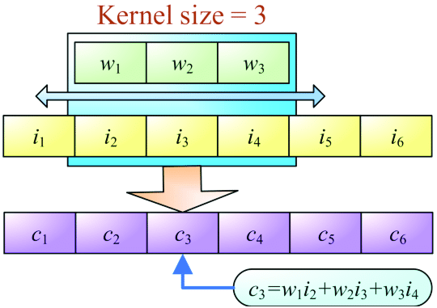{ width="700" }
<figcaption>
A figure showing a signal being convolved with a filter.
<a href="https://www.researchgate.net/figure/Calculations-involved-in-a-1D-convolution-operation_fig3_324177888">
Image credit </a>
</figcaption>
</figure>

I hope convolution makes sense now. Scattering and gathering are two different ways of executing this fairly
simple process which has quite an impact on performance. If we were doing 1D convolution on a GPU, from which
point of view do we program the threads? If they are scattering, they take the point of view of each input element.
Each element takes its own value, multiplies by a filter value and accumulates in the output array. Now we have a
whole segment of threads which can all read from their own input element only once, but which have
a huge amount of contention as they have to synchronize their writes to either shared or global memory for the
output. This also removes the ability for each thread to accumulate the result locally in a register. If they
instead followed the gathering paradigm, each thread would take the point of view of their own output element.
They would each do lots of reads from both the input signal and the filter weights, they would do local
accumulation in a register, and each have a single write to memory with no overlap. As you might remember, you
should always prefer more reads than writes. Reads are very parallelizable, writes usually require synchronization.

This can be extended to lots of different algorithms. For matrix multiplication, it's recommended to use
gathering, from the point of view of the output element for each thread. For some more material on
scattering and gathering, there is a paper on it [from '07][10].

## A Histogram of Violence
If these concepts still feel a bit iffy, here's a rambling and slightly incoherent
section to make you feel worse.

<figure markdown>
{ width="700" }
<figcaption>
Ready for more?
<a href="https://i.kym-cdn.com/photos/images/original/001/745/106/e66.jpg">
Image credit </a>
</figcaption>
</figure>

Let's take things a bit further and look at shared memory, scattering, gathering,
and programming for memory hierarchies with a case study of computing a histogram.

We will take in a list of positive floats and a number of bins.
Each float is quantized with a floor function to a nearest bin. So for a list of
numbers from 0 to 4.99999, we would have bins 0, 1, 2, 3 and 4. You can find
the code in ```m1_memory_hierarchies::code::gpu_histogram``` or [online][8].

I will assume you read and looked at all of the code from the ```gpu_add``` project.
The wgpu host (cpu) side code is pretty much the same, except I did a bit of
refactoring and put it into ```src::utility.rs::run_compute_shader```. It is still
naively allocating and deallocating buffers, and compiling shaders for our program.
I offset this by using really large data amounts and threads. Histogram computation
is going to be mostly about moving data through memory and getting the swarm of
threads to correctly write to the small number of bins. This is called contention.

When we have 4 threads all wanting to increment the number 0 bin, they are contending
for the write access. If they were all just reading from the number 0 bin, they
could all safely do so at a much larger scale, as long as the value didn't change.
But it will in the case of the histogram. First off there are these basic
configuration parameters to the different (six) histogram implementations.
You will find these parameters in ```main()``` -

=== "Rust"

    ```rust
    let data_count: usize = 2000000;
    let bin_count: usize = 4;
    let elements_per_thread: usize = 16;
    let debug: bool = false;
    let time_limit_seconds: f32 = 2.0;
    ```

```data_count``` is how many data elements we will be using to create our histogram.
```bin_count``` is how many bins to sort them into. ```elements_per_thread``` is
something I will be using later, when we can have each GPU thread handle more than
a single data element. ```debug``` turns on some print statements which will say
whether the function had the correct result and how many blocks/threads were launched
to handle the amount of data. ```time_limit_seconds``` is how long we will run our
functions for to measure their performance. For this case we will be counting iterations.
So how many runs could we do in 2 seconds, including allocations and transfers.

So let's look at the basic compute shader -

=== "WGSL"

    ```rust
    struct Uniform {
        element_count: u32,
        not_used: u32,
        not_used: u32,
        not_used: u32,
    };

    @group(0) @binding(0)
    var<uniform> dimensions: Uniform;

    @group(0) @binding(1)
    var<storage, read> input: array<f32>;

    // Bind a read/write array
    @group(0) @binding(2)
    var<storage, read_write> output: array<u32>;

    @compute @workgroup_size(32, 1, 1) 
    fn histogram(@builtin(global_invocation_id) global_id: vec3<u32>) {
        let thread_id: u32 = global_id.x;
        
        if (thread_id < dimensions.element_count) {
            let index: u32 = u32(floor(input[thread_id]));
            output[index] += 1u;        
        }
    }
    ```

Each thread finds its *global thread ID*, ensures that is within a
valid range loads an element, computes the bin, and then increments
the corresponding bin. Why is this incorrect?

??? success "Answer"

    There is no coordination when reading and writing the bin number.
    In principle a 100 threads could read the value from ```ouput[index]```,
    which could be ```5```, decide that the incremented value should be ```6```.
    This could happen continuously, resulting in invalid results.

What we can do instead is to use a synchronization method called atomics.
Atomics will be further introduced in the concurrency module. But they're
basically very small locks which usually have hardware support, meaning
they support a very limited set of operations, but they are quite fast
and happen closer to the data. Atomics are good for either single elements of
data or however many data elements you can pack into 32- or 64-bit values.
It is system, API and extension dependant what is supported. Atomics ensure
that all writes happen correctly, which has a different meaning based on
your requirements, but ensuring this correctness, even with hardware support,
is slower than not using it, as only one incrementation can happen at a time.
It can also be a lot slower if the atomic operation is not available
in hardware and has to be software emulated instead.
WGSL has atomics available, and they can be called on like this -

=== "WGSL"

    ```rust
        atomicAdd(&output[index], 1u);   
    ```

We also have to declare the affected array as being atomic, and we have to
provide a correct size at compile time.

=== "WGSL"

    ```rust
    @group(0) @binding(2)
    var<storage, read_write> output: array<atomic<u32>, 10>; 
    ```

You don't have to do so in other languages such as CUDA, but I would really like
some flexibility so we don't have to keep a thousand different variations of
the shader around for something so basic. What we can do instead, because programs
are just strings, is to append a constant definition at the top of the shader.
I do that with this snippet in the Rust code -

=== "Rust"

    ```rust
    let bin_count_specialization: String = format!("const BIN_COUNT: u32 = {}u;\n", bin_count);
    let shader_file: String = 
        format!(
            "{}{}{}", 
            bin_count_specialization, 
            base_shader_file
        );
    ```

As we just appended this definition at the top we can now put in the ```BIN_COUNT```
constant instead of the hardcoded 10 and get a variable amount of bins with recompilation.

=== "WGSL"

    ```rust
    @group(0) @binding(2)
    var<storage, read_write> output: array<atomic<u32>, BIN_COUNT>; 
    ```

So now, we can write a more correct version, found in ```histogram_atomic.wgsl```.

=== "WGSL"

    ```rust
    @compute @workgroup_size(32, 1, 1) 
    fn histogram(@builtin(global_invocation_id) global_id: vec3<u32>) {
        let thread_id: u32 = global_id.x;
        
        if (thread_id < dimensions.element_count) {
            let index: u32 = u32(floor(input[thread_id]));
            atomicAdd(&output[index], 1u);        
        }
    }
    ```

Now that we have correctness, we can start looking at performance. Right now
the work happens at two levels. The thread loads a value from RAM, computes
the index, then uses the atomic, to increment the value in RAM. As you can imagine
the more threads and the fewer bins the more *contention* there will be for the
few atomic data elements in the output array. Contention is generally bad. Some
data is being shared between threads, and in order to ensure correctness we have
to use synchronization methods, thus slowing each thread down that ends up waiting
for access to the data through the synchronization mechanism.

The greater the ratio between threads to bins, the greater the contention. This
is almost true. However, the data generated for this example is uniformly distributed.
There is a uniform amount of data going into each bin. If the data had instead been
skewed towards the smaller bin indices, the contention is greater for a few bins
and smaller for the rest. However, for our function to complete, all of them need
to be finished, so we are likely to be bottlenecked by the most hotly contended bins.

One way to mitigate this, is to move some of the contention to a faster
layer in the memory hierarchy. As I wrote earlier, with GPU's we're allowed
to explicitly program a section of memory named shared memory.
With shared memory, we also need to know the size at compile time. We basically
treat this as a stack allocated array that is shared between all threads in a
work group. We can also need to declare it as atomic in WGSL.
The code can be found in ```histogram_shared.wgsl``` -

=== "WGSL"

    ```rust
    struct Uniform {
        element_count: u32,
        not_used: u32,
        not_used: u32,
        not_used: u32,
    };

    @group(0) @binding(0)
    var<uniform> dimensions: Uniform;

    @group(0) @binding(1)
    var<storage, read> input: array<f32>;

    @group(0) @binding(2)
    var<storage, read_write> output: array<atomic<u32>, BIN_COUNT>;

    var<workgroup> shared_histogram: array<atomic<u32>, BIN_COUNT>;

    @compute @workgroup_size(32, 1, 1) 
    fn histogram(
        @builtin(global_invocation_id) global_id: vec3<u32>,
        @builtin(local_invocation_id) local_id: vec3<u32>
        ) {

        let thread_id: u32 = global_id.x;
        if (thread_id < dimensions.element_count) {
            let index: u32 = u32(floor(input[thread_id]));
            atomicAdd(&shared_histogram[index], 1u);
        }

        workgroupBarrier();

        var local_index: u32 = local_id.x;
        while (local_index < BIN_COUNT) {
            atomicAdd(&output[local_index], shared_histogram[local_index]);
            local_index += 32u;
        }
    }
    ```

Now the code has two new elements. First off, each thread in the work group,
we really have to start thinking in terms of the work group now, has to load
a data element from memory. Then we move some of the contention of the binning
into shared memory. We now have a small very fast array where our
32 threads can create a sub histogram. We still need the atomic operations for
synchronization, but contention is now much cheaper. A rule of thumb is the speed
of access in RAM vs. L1 cache/shared memory is 30 to 1. So, each thread loads
1 element of data and writes it to the shared histogram. Then we have a
work group barrier which ensures that we have completed computing the histogram
for the work group and that we can safely begin adding the shared memory histogram
to the global histogram.

We can take things a step further. What if we accumulated part of the histogram
locally in registers? That would be quite fast as there would be no need for
any form of synchronization mechanism as the data would all be thread local,
as in private for each thread. We now get to a point where we have two concepts
you have to get comfortable with. We will have a couple of different sections
of the shader, wherein different things will happen. You have to think of these
sections as being distinct and as such what indices were used in the first section
don't necessarily have a relation to the indices in the second section.
The second thing, coalescing, is something I will get to once I have done the
"paedagogically wrong way to do things"-example below, also found in
```histogram_non_coalesced.wgsl``` -

=== "WGSL"

    ```rust
    // We would have to hardcode this line if we didn't use the bin_count specialization
    // when compiling the shader
    //const BIN_COUNT: u32 = 8u;
    //const ELEMENTS_PER_THREAD: u32 = 8u;

    struct Uniform {
        element_count: u32,
        not_used: u32,
        not_used: u32,
        not_used: u32,
    };

    @group(0) @binding(0)
    var<uniform> dimensions: Uniform;

    @group(0) @binding(1)
    var<storage, read> input: array<f32>;

    @group(0) @binding(2)
    var<storage, read_write> output: array<atomic<u32>, BIN_COUNT>;

    var<workgroup> shared_histogram: array<atomic<u32>, BIN_COUNT>;

    var<private> local_histogram: array<u32, BIN_COUNT>;

    @compute @workgroup_size(32, 1, 1) 
    fn histogram(
        @builtin(global_invocation_id) global_id: vec3<u32>,
        @builtin(workgroup_id) group_id: vec3<u32>, 
        @builtin(local_invocation_id) local_id: vec3<u32>
    ) {
        var index: u32 = group_id.x * ELEMENTS_PER_THREAD * 32u + local_id.x * ELEMENTS_PER_THREAD;
        if index < dimensions.element_count {
            for(var elements_fetched: u32 = 0u; elements_fetched < ELEMENTS_PER_THREAD; elements_fetched += 1u) {
                local_histogram[u32(floor(input[index]))] += 1u;
                index += 1u;
                if (dimensions.element_count <= index) {
                    break;
                }
            }
        }

        workgroupBarrier();

        for(var local_index: u32 = 0u; local_index < BIN_COUNT; local_index += 1u) {
            atomicAdd(&shared_histogram[local_index], local_histogram[local_index]);
        }

        workgroupBarrier();

        var local_index: u32 = local_id.x;
        while (local_index < BIN_COUNT) {
            atomicAdd(&output[local_index], shared_histogram[local_index]);
            local_index += 32u;
        }
    }
    ```

As you can see, I introduced a new definition, ```ELEMENTS_PER_THREAD```. Each
thread will load that amount of data and compute a subhistogram in thread local
memory, which, depending on the register pressure, as in how many local variables
are allocated between all of the threads relative to the size of the register file,
will reside in registers, and possibly L1 cache. Computing the subhistogram locally
increases our register pressure, but decreases the amount of contention for the
individual bins. One thing we do however, is to throttle the amount of parallelism
in our solution. We use less threads to compute the same amount of elements.
This trade-off is likely something you have to test, as the cost of scheduling
and launching threads is non-neglible, but in a situation where you might have
lots of different workloads happening on the GPU at the same time, if you can
find a sweet spot where you are using less threads to get the same or better
performance, you have made a different type of optimization. In some cases,
we might even be willing to extend this trade-off beyond the optimal saddle point,
to create a shader which takes longer to execute, but uses even less threads in
order to free up the GPU to do other things at the same time.

Back to the code. We now have three distinct sections, which reflect our memory
hierarchy. In the first section, the threads each load and compute on a number
of elements, storing the results in a thread local array. We hit a barrier
to make sure all threads are done. Then each thread adds its local results
to the shared histogram with atomic operations. But hold up...

We don't actually need the first barrier. We are already synchronizing with
atomics when writing to the shared histogram, so we don't need the first
barrier.

=== "WGSL"

    ```rust
    @compute @workgroup_size(32, 1, 1) 
    fn histogram(
        @builtin(global_invocation_id) global_id: vec3<u32>,
        @builtin(workgroup_id) group_id: vec3<u32>, 
        @builtin(local_invocation_id) local_id: vec3<u32>
    ) {
        var index: u32 = group_id.x * ELEMENTS_PER_THREAD * 32u + local_id.x * ELEMENTS_PER_THREAD;
        if index < dimensions.element_count {
            for(var elements_fetched: u32 = 0u; elements_fetched < ELEMENTS_PER_THREAD; elements_fetched += 1u) {
                local_histogram[u32(floor(input[index]))] += 1u;
                index += 1u;
                if (dimensions.element_count <= index) {
                    break;
                }
            }
        }

        for(var local_index: u32 = 0u; local_index < BIN_COUNT; local_index += 1u) {
            atomicAdd(&shared_histogram[local_index], local_histogram[local_index]);
        }

        workgroupBarrier();

        var local_index: u32 = local_id.x;
        while (local_index < BIN_COUNT) {
            atomicAdd(&output[local_index], shared_histogram[local_index]);
            local_index += 32u;
        }
    }
    ```

In the third section, each thread must now take ownership of a section of shared memory
and write it to global memory, which, again, has nothing to do with the indexing in the
first parts. One thing we are missing in the first section is coalesced accessing.
As the threads in the work group share cache lines, threads should generally avoid reading
from global memory completely incrementally. Instead we likely want a work group sized stride
in order to get coalesced accesses. If you feel iffy about what that concept was, go back and
read about it. It's very important. If the explanation in this guide isn't enough for you
to feel at ease with the concept, try looking it up on the interwebz.

Now for the next iteration of the shader, which you can find in ```histogram_local.wgsl``` -

=== "WGSL"

    ```rust
    // We would have to hardcode this line if we didn't use the bin_count specialization
    // when compiling the shader
    //const BIN_COUNT: u32 = 5u;
    //const ELEMENTS_PER_THREAD: u32 = 256u;

    struct Uniform {
        element_count: u32,
        not_used: u32,
        not_used: u32,
        not_used: u32,
    };

    @group(0) @binding(0)
    var<uniform> dimensions: Uniform;

    @group(0) @binding(1)
    var<storage, read> input: array<f32>;

    @group(0) @binding(2)
    var<storage, read_write> output: array<atomic<u32>, BIN_COUNT>;

    var<workgroup> shared_histogram: array<atomic<u32>, BIN_COUNT>;

    var<private> local_histogram: array<u32, BIN_COUNT>;

    @compute @workgroup_size(32, 1, 1) 
    fn histogram(
        @builtin(global_invocation_id) global_id: vec3<u32>,
        @builtin(workgroup_id) group_id: vec3<u32>, 
        @builtin(local_invocation_id) local_id: vec3<u32>
        ) {
            var index: u32 = group_id.x * ELEMENTS_PER_THREAD * 32u + local_id.x;
            if index < dimensions.element_count {
                for(var elements_fetched: u32 = 0u; elements_fetched < ELEMENTS_PER_THREAD; elements_fetched += 1u) {
                    local_histogram[u32(floor(input[index]))] += 1u;
                    index += 32u;
                    if (dimensions.element_count <= index) {
                        break;
                    }
                }
            }

            for(var local_index: u32 = 0u; local_index < BIN_COUNT; local_index += 1u) {
                atomicAdd(&shared_histogram[local_index], local_histogram[local_index]);
            }

            workgroupBarrier();

            var local_index: u32 = local_id.x;
            while (local_index < BIN_COUNT) {
                if (shared_histogram[local_index] != 0u) {
                    atomicAdd(&output[local_index], shared_histogram[local_index]);
                }
                local_index += 32u;
            }
    }
    ```

Note that our initial index calculation became easier in part 1 and that we now stride by ```32u```,
which is the size of the work group. One thing to note now is that our shader is going to scale with
three things. The number of data elements, the number of elements per thread and the number of
output bins. Given this dense way of solving the histogram problem, our register pressure is likely
to go up quite a bit with the number of output bins, while our contention falls. We can try to
lower this contention a little bit in exchange for the threads going down different paths, by
looking at the performance difference with ordered data and randomized data. Another thing
we could do to improve the scaling of the solution would be to use a dense array in the shared
and global arrays, it is a bit complicated/expensive to make them sparse given that we are using
atomics for synchronization, so I'll just focus on one easy way to lower our register pressure.
Using a sparse array for our local histogram. This array will use every second array entry as
a histogram bin index and every second plus one entry as the count. In this case our scaling
of the local array becomes two times the number of elements per thread, instead of the number
of output bins. Our shared histogram still scales with with the number of output bins.
You can find the shader in ```histogram_sparse_unoptimized.wgsl``` -

=== "WGSL"

    ```rust
    // We would have to hardcode this line if we didn't use the bin_count specialization
    // when compiling the shader
    //const BIN_COUNT: u32 = Nu;
    //const ELEMENTS_PER_THREAD: u32 = Nu;
    // const SPARSE_ARRAY_SIZE: u32 = 2 * ELEMENTS_PER_THREAD

    struct Uniform {
        element_count: u32,
        not_used: u32,
        not_used: u32,
        not_used: u32,
    };

    @group(0) @binding(0)
    var<uniform> dimensions: Uniform;

    @group(0) @binding(1)
    var<storage, read> input: array<f32>;

    @group(0) @binding(2)
    var<storage, read_write> output: array<atomic<u32>, BIN_COUNT>;

    var<workgroup> shared_histogram: array<atomic<u32>, BIN_COUNT>;

    var<private> local_histogram: array<u32, SPARSE_ARRAY_SIZE>;

    @compute @workgroup_size(32, 1, 1) 
    fn histogram(
        @builtin(global_invocation_id) global_id: vec3<u32>,
        @builtin(workgroup_id) group_id: vec3<u32>, 
        @builtin(local_invocation_id) local_id: vec3<u32>
        ) {
            var global_index: u32 = group_id.x * ELEMENTS_PER_THREAD * 32u + local_id.x;
            var entry: u32 = 0u;
            if global_index < dimensions.element_count {
                for(var elements_fetched: u32 = 0u; elements_fetched < ELEMENTS_PER_THREAD; elements_fetched += 1u) {
                    entry = u32(floor(input[global_index]));
                    for (var sparse_index: u32 = 0u; sparse_index < SPARSE_ARRAY_SIZE; sparse_index += 2u ) {
                        if (local_histogram[sparse_index] == entry) {
                            local_histogram[sparse_index + 1u] += 1u;
                            break;
                        }
                        if (local_histogram[sparse_index] != entry & local_histogram[sparse_index + 1u] == 0u){
                            local_histogram[sparse_index] = entry;
                            local_histogram[sparse_index + 1u] = 1u;
                            break;
                        }
                    }

                    global_index += 32u;
                    if (dimensions.element_count <= global_index) {
                        break;
                    }
                }
            }

            for(var local_index: u32 = 0u; local_index < SPARSE_ARRAY_SIZE; local_index += 2u) {
                if (0u < local_histogram[local_index + 1u]) {
                    let entry: u32 = local_histogram[local_index];
                    atomicAdd(&shared_histogram[entry], local_histogram[local_index + 1u]);
                }
            }

            workgroupBarrier();

            var local_index: u32 = local_id.x;
            while (local_index < BIN_COUNT) {
                if (shared_histogram[local_index] != 0u) {
                    atomicAdd(&output[local_index], shared_histogram[local_index]);
                }
                local_index += 32u;
            }
    }
    ```

Note that we introduce some work group divergence with this sparse array as each thread has
to look for the first entry which satisfies its requirements, which is highly data sequence
dependent. Note that the way I implemented the sparse array is, while simpler, somewhat
reminiscent of how hash maps are implemented.

=== "WGSL"

    ```rust
    // We would have to hardcode this line if we didn't use the bin_count specialization
    // when compiling the shader
    //const BIN_COUNT: u32 = 5u;
    //const ELEMENTS_PER_THREAD: u32 = 256u;

    struct Uniform {
        element_count: u32,
        not_used: u32,
        not_used: u32,
        not_used: u32,
    };

    @group(0) @binding(0)
    var<uniform> dimensions: Uniform;

    @group(0) @binding(1)
    var<storage, read> input: array<f32>;

    @group(0) @binding(2)
    var<storage, read_write> output: array<atomic<u32>, BIN_COUNT>;

    var<workgroup> shared_histogram: array<atomic<u32>, BIN_COUNT>;

    var<private> local_entries: array<u32, ELEMENTS_PER_THREAD>;
    var<private> local_counts: array<u32, ELEMENTS_PER_THREAD>;

    @compute @workgroup_size(32, 1, 1) 
    fn histogram(
        @builtin(global_invocation_id) global_id: vec3<u32>,
        @builtin(workgroup_id) group_id: vec3<u32>, 
        @builtin(local_invocation_id) local_id: vec3<u32>
        ) {
            var global_index: u32 = group_id.x * ELEMENTS_PER_THREAD * 32u + local_id.x;
            var unoccupied_index: u32 = 0u;
            if global_index < dimensions.element_count {
                for(var elements_fetched: u32 = 0u; elements_fetched < ELEMENTS_PER_THREAD; elements_fetched += 1u) {
                    let entry: u32 = u32(floor(input[global_index]));
                    var sparse_index: u32 = 0u;
                    while (sparse_index < unoccupied_index ) {
                        if (local_entries[sparse_index] == entry) {
                            local_counts[sparse_index] += 1u;
                            break;
                        }
                        sparse_index += 1u;
                    }

                    if (sparse_index == unoccupied_index) {
                        unoccupied_index += 1u;
                        local_counts[sparse_index] = 1u;
                        local_entries[sparse_index] = entry;
                    }

                    global_index += 32u;
                    if (dimensions.element_count <= global_index) {
                        break;
                    }
                }
            }

            for(var local_index: u32 = 0u; local_index < ELEMENTS_PER_THREAD; local_index += 1u) {
                if (0u < local_counts[local_index]) {
                    let entry: u32 = local_entries[local_index];
                    atomicAdd(&shared_histogram[entry], local_counts[local_index]);
                }
            }

            workgroupBarrier();

            var local_index: u32 = local_id.x;
            while (local_index < BIN_COUNT) {
                if (shared_histogram[local_index] != 0u) {
                    atomicAdd(&output[local_index], shared_histogram[local_index]);
                }
                local_index += 32u;
            }
    }
    ```

Some alterations were made. The what made the biggest difference was splitting up ```local_histogram[]``` into
two arrays, which also meant I could just base their sizes on ```ELEMENTS_PER_THREAD```. This is quite in
line with branchless programming, which will be introduced in the module about real-time systems.
I made some additional tweaks that gave a small, but reasonably consistent boost, trying to limit
the amount of times the local data is looped by keeping track of the first unoccupied space.

Finally, before we start timing the various versions, let's see what the base level is for the system. I am
timing it on a laptop with an integrated GPU, which means the feature level of the GPU isn't very high, the
transfer costs are quite low, but the performance is also relatively low. In this instance I chose to
time the number of iterations possible within a 2 second window. To get my baseline performance I set the
number of data elements to 1, the number of output bins to 1 and the number of elements per thread to 1.

<figure markdown>
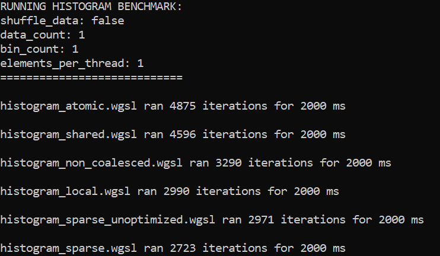{ width="700" }
<figcaption>
Setting data size to 1 and output bins to 1, we can see the cost of allocation, transfer and compilation.
This benchmark was run on my laptop boasting an Intel i7-1185G7, 3.0 GHz with 32GB of RAM. The operating system was
Windows 10. The L1/L2/L3 caches were 320 KB, 5 MB and 12 MB respectively.
</figcaption>
</figure>

As you can see, there is a signficant difference when running it like this. The difference cannot lie in the
allocation and transfer of the buffers, it is only 1 value for each buffer for all of the shaders, after all.
The difference probably lies in recompiling the shader with every invocation instead of caching it. The
later shaders are longer and more complex, likely resulting in longer compilation times.

In the next run, I will run as big a data count as I can get the system to accept, with a low output bin
count, one data element handled per thread and the data not shuffled. This results in the input data being
monotonically increasing in an even distribution. Having each thread handle only a single data element
will put the last four versions of the histogram code at a disadvantage.

<figure markdown>
{ width="700" }
<figcaption>
Setting data size to 2000000, output bins to 10, 1 data element per thread and no shuffling data.
This benchmark was run on my laptop boasting an Intel i7-1185G7, 3.0 GHz with 32GB of RAM. The operating system was
Windows 10. The L1/L2/L3 caches were 320 KB, 5 MB and 12 MB respectively.
</figcaption>
</figure>

At this point all of the non-naive implementations seem to perform more or less the same. The naive version
is likely suffering under contention as all threads are trying to write to the same 10 atomic values. To
highlight this we can use a single output bin instead.

<figure markdown>
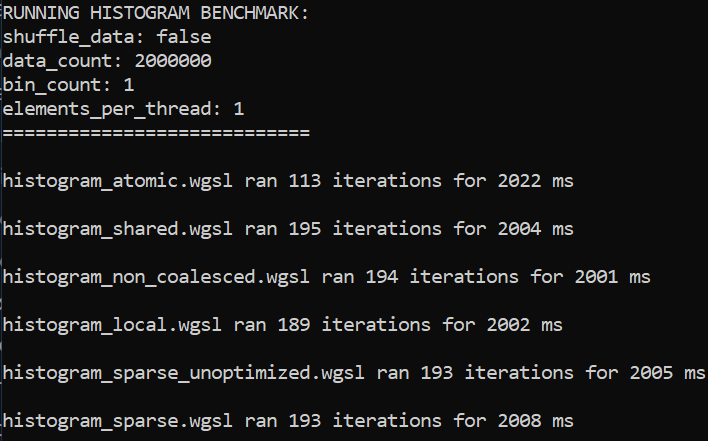{ width="700" }
<figcaption>
Setting data size to 2000000, output bins to 1, 1 data element per thread and no shuffling data.
This benchmark was run on my laptop boasting an Intel i7-1185G7, 3.0 GHz with 32GB of RAM. The operating system was
Windows 10. The L1/L2/L3 caches were 320 KB, 5 MB and 12 MB respectively.
</figcaption>
</figure>

We now allocate less shared memory and there is likely to be a signficant mitigation in work group divergence,
as all threads have to write to the same output bin, but the speed up is least significant for the
naive implementation. Going back to the settings from before, let's take a look at what happens
when we begin using completely random, but uniformly distributed, numbers as input.

<figure markdown>
{ width="700" }
<figcaption>
Setting data size to 2000000, output bins to 10, 1 data element per thread and random data.
This benchmark was run on my laptop boasting an Intel i7-1185G7, 3.0 GHz with 32GB of RAM. The operating system was
Windows 10. The L1/L2/L3 caches were 320 KB, 5 MB and 12 MB respectively.
</figcaption>
</figure>

If we begin increasing the number of data elements per thread to 4, we get the following measurements
with and without shuffling -

<figure markdown>
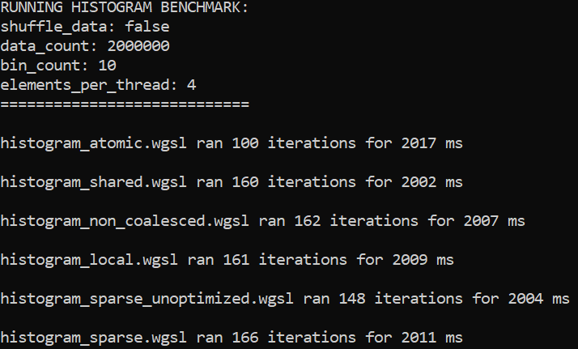{ width="700" }
<figcaption>
Setting data size to 2000000, output bins to 10, 4 data elements per thread and no shuffled data.
This benchmark was run on my laptop boasting an Intel i7-1185G7, 3.0 GHz with 32GB of RAM. The operating system was
Windows 10. The L1/L2/L3 caches were 320 KB, 5 MB and 12 MB respectively.
</figcaption>
</figure>

<figure markdown>
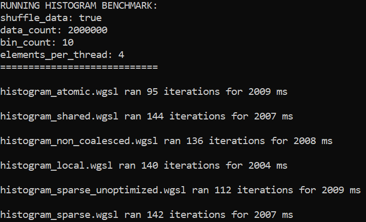{ width="700" }
<figcaption>
Setting data size to 2000000, output bins to 10, 4 data elements per thread and shuffled data.
This benchmark was run on my laptop boasting an Intel i7-1185G7, 3.0 GHz with 32GB of RAM. The operating system was
Windows 10. The L1/L2/L3 caches were 320 KB, 5 MB and 12 MB respectively.
</figcaption>
</figure>

As I'll remind you, the two middle shaders have a scaling issue when it comes to local memory. They MUST
allocate a ```bin_count``` sized array as there are no guarantees in terms of data. The last two
scale their thread local memory with ```elements_per_thread```. So let's try upping both of those -

<figure markdown>
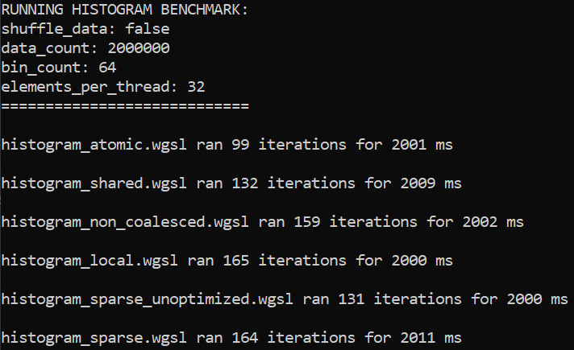{ width="700" }
<figcaption>
Setting data size to 2000000, output bins to 64, 32 data elements per thread and no shuffled data.
This benchmark was run on my laptop boasting an Intel i7-1185G7, 3.0 GHz with 32GB of RAM. The operating system was
Windows 10. The L1/L2/L3 caches were 320 KB, 5 MB and 12 MB respectively.
</figcaption>
</figure>

<figure markdown>
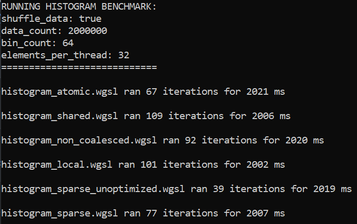{ width="700" }
<figcaption>
Setting data size to 2000000, output bins to 64, 32 data elements per thread and shuffled data.
This benchmark was run on my laptop boasting an Intel i7-1185G7, 3.0 GHz with 32GB of RAM. The operating system was
Windows 10. The L1/L2/L3 caches were 320 KB, 5 MB and 12 MB respectively.
</figcaption>
</figure>

As can be seen the sparse version doesn't really hold up that well in this case. It has to allocate quite
a bit of memory and is overall more complex, but it does quite well if we have presorted our data. Or at least
it keeps up with ```histogram_local.wgsl```. If we go for a more real-world like scenario where we have more
bins and less elements per thread we get these measurements -

<figure markdown>
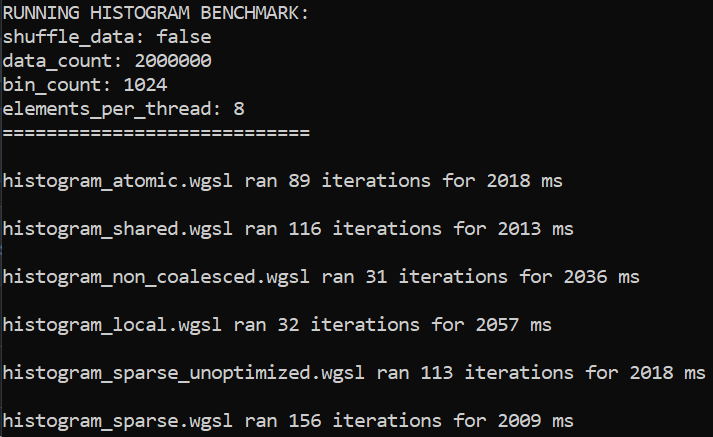{ width="700" }
<figcaption>
Setting data size to 2000000, output bins to 1024, 8 data elements per thread and no shuffled data.
This benchmark was run on my laptop boasting an Intel i7-1185G7, 3.0 GHz with 32GB of RAM. The operating system was
Windows 10. The L1/L2/L3 caches were 320 KB, 5 MB and 12 MB respectively.
</figcaption>
</figure>

<figure markdown>
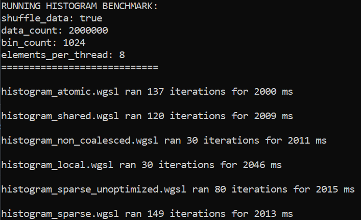{ width="700" }
<figcaption>
Setting data size to 2000000, output bins to 1024, 8 data elements per thread and shuffled data.
This benchmark was run on my laptop boasting an Intel i7-1185G7, 3.0 GHz with 32GB of RAM. The operating system was
Windows 10. The L1/L2/L3 caches were 320 KB, 5 MB and 12 MB respectively.
</figcaption>
</figure>

Here we can see the total collapse of the ```histogram_local.wgsl``` as it probably overloads its register file due to
allocating too much thread local memory. ```histogram_shared.wgsl``` also does worse than expected due to the
size of what it has to allocate in shared memory. Interestingly ```histogram_sparse.wgsl``` still performs
well. It is worth noting that the naive version performs significantly better when the input data is random.
This can sometimes be seen when implementations are bound by contention. Distributing the data evenly and
randomly can mitigate contention. You are more than welcome to play around with these numbers yourselves and
see what sort of behavior you can elicit from your own system. In the end, these different implementations are
good at different scenarios. If you were building a library function for computing histograms, you might implement
the four main ones and use some heuristic to select which one to run in order to get the optimal running time. If
I were to just choose two I would go for the atomic and sparse. The simpler implementations are likely to be good
enough for a bunch of scenarios, whereas the sparse version seems to scale very well and uses a
significantly smaller amount of threads. Having more threads available could allow us to run more inputs
and invocations at the same time and assembling these subhistograms at the end.

<figure markdown>
{ width="700" }
<figcaption>
<a href="http://www.quickmeme.com/meme/3ug8e9"> Image credit </a>
</figcaption>
</figure>

Now back to computational graphs and memory hierarchies!

## Additional Reading
To learn more about GPU's and memory checkout these - [a GPU glossary][14], [The GPU Memory Hierarchy][0],
[GPU Memory Hierarchy][1], [GPU Programming][2], [Hopper Architecture In-Depth][3] and
[GPU architecture and CUDA Programming][4]. The last entry is highly recommended.

You can read more about [optimzing shaders with shared memory][7] and [optimizing a matmul kernel][11].
A slightly more detailed explanation of [asynchronous memory transfers][5] for GPUs. If you want to
learn more about wgpu, the most used tutorial is [Learn Wgpu][6]. One of the most popular books about
GPGPU programming is [Programming Massively Parallel Processors][9].

[0]: https://www.cs.cmu.edu/afs/cs/academic/class/15869-f11/www/lectures/08_mem_hierarchy.pdf
[1]: http://meseec.ce.rit.edu/551-projects/spring2015/3-2.pdf
[2]: http://dlsys.cs.washington.edu/pdf/lecture5.pdf
[3]: https://developer.nvidia.com/blog/nvidia-hopper-architecture-in-depth/
[4]: https://gfxcourses.stanford.edu/cs149/fall22/lecture/gpuarch/
[5]: https://engineering.purdue.edu/~smidkiff/ece563/NVidiaGPUTeachingToolkit/Mod14DataXfer/Mod14DataXfer.pdf
[6]: https://sotrh.github.io/learn-wgpu/
[7]: https://docs.nvidia.com/cuda/cuda-c-best-practices-guide/index.html#shared-memory
[8]: https://github.com/absorensen/numbers_go_brrrr/tree/main/m1_memory_hierarchies/code/gpu_histogram
[9]: https://shop.elsevier.com/books/programming-massively-parallel-processors/hwu/978-0-323-91231-0
[10]: https://www.researchgate.net/publication/220781807_Efficient_gather_and_scatter_operations_on_graphics_processors
[11]: https://www.nuss-and-bolts.com/p/optimizing-a-webgpu-matmul-kernel
[12]: https://github.com/absorensen/numbers_go_brrrr/tree/main/m1_memory_hierarchies/code/gpu_add
[13]: https://sotrh.github.io/learn-wgpu/
[14]: https://modal.com/gpu-glossary
