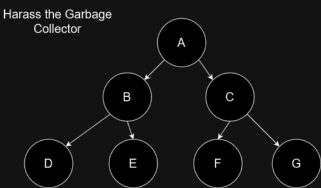

# 👨🏼‍💻 Exercises

## m1::e0 - Vector Memory
Write out the stack and heap memory of THIS sequence of vector operations. You can represent unitialized
memory with a *. The vector must double its capacity and copy over each element once it gets a push operation
while at capacity. The vector must resize to half its size and copy over each active element once it gets a
pop operation while at quarter capacity.

* Create new vector of capacity 4
* .push(5)
* .push(2)
* .push(1)
* .pop()
* .push(42)
* .push(350)
* .push(1337)
* .push(1)
* .push(2)
* .push(5)
* .push(10)
* .pop()
* .pop()
* .pop()
* .pop()
* .pop()
* .pop()
* .pop()
* .pop()

Barring a few errors here and there this should be a simple exercise. Except.
Are you sure you got all of the undefined (*) values right?

Which common operation could have replaced the last sequence of .pop() operations
in the case where you wouldn't be using the popped values?

## m1::e1 - Linearized Indexing  
You have an array of dimensions ```MN``` in a linearized array ```data```, write pseudo code that iterates
through all data elements using two for-loops and doubles the value in place.

You have an array of dimensions ```MNK``` in a linearized array ```data```, write pseudo code that iterates
through all data elements using three for-loops and triples the value in place.

## m1::e2 - Killing the Garbage Collector
<figure markdown>
{ width="500" }
<figcaption>
Where would you add a pointer to hurt garbage collection the most?
</figcaption>
</figure>

Adding which pointer would result in the most nodes not being properly garbage collected?  
If the garbage collector implements cycle detection to depth 2 adding which pointer would break it?
The nodes can't point to themselves.  

<figure markdown>
{ width="500" }
<figcaption>
How could you make this sort of general graph, with very few restrictions, safe for garbage collection?
</figcaption>
</figure>

In the case of the multiply connected nodes, can you come up with a structural solution which allows
us to make arbitrary graphs in a garbage collected setting or safe in a C++/Rust setting?

## m1::e3 - Gathering Histograms
Extend the program in ```code::gpu_histogram``` with a shader which uses the gathering paradigm, instead
of scattering.

??? note "Hints"

    * If the data is unsorted, each thread or work group will need to run through the entire data set.

## GPU Programming
This serves as both one of the few instances where we can explicitly program parts of the memory hierarchy
(shared memory resides in the L1 cache), but also as an introduction to parallel thinking, which you will
need in the next module. A useful tool for calculating offsets in WGSL can be found [here][3]
The exercises here are fitting as a hand-in if you are doing a course. From experience,
just doing the 1D convolution is plenty complicated for someone coming from Python. You'll get the point of how
to use shared memory doing it. Doing matrix multiplication as well is good practice, but not strictly necessary.

??? note "Hints"

    * You have to hard code the size of the shared memory array, there are ways around it, but they are outside
    the scope of the exercise. Just pick a size that is bigger than your work group size.
    * A common issue is for people to forget to set the correct size for shared memory arrays. In other
    languages, indexing outside of an array might get you a catastrophic error, such as a segmentation fault.
    In WGSL, it depends on the implementation. But one behavior spotted in the wild is replication of the
    [n-1] value in perpetuity.
    * WGSL will complain if you have unused variables.
    * Try to think of the part of your shader which loads values into shared memory as completely distinct
    from the part of your shader which is using that data. This includes which thread ID's corresponds to
    which piece of data.
    * Don't be disheartened when the first version of your code isn't faster than the non-shared memory version
    of your shader is faster once you've mitigated branching through padding. The 1D convolution problem
    doesn't maximally expose memory bandwidth problems as well as the harder matrix multiplication
    (a 2D problem). You might see the shared memory version pull ahead once you have completed some of
    the improvements suggested in the next item.
    * Ideally, when loading data into shared memory you want to have as few if-statements as possible. In the
    best case you can use a for-loop to stride through the data you are loading with a stride equal to the
    amount of active threads in the work group. This should result in coalesced memory reads. You should
    look that up.
    * It can be useful to see what the GPU is doing. Check out how to get
    [env_logger](https://docs.rs/env_logger/latest/env_logger/) to give you more information about what wgpu
    is doing.

### m1::e4 - 1D Convolution
Go to ```m1_memory_hierarchies::code::gpu_hand_in``` or [online][0] and follow the instructions.
You need to do 3 different version of 1D convolution, a naive version, one with zero padding of the input
signal and one with optimal usage of shared memory.

### m1::e5 - Matrix Multiplication
For the second section, also in ```gpu_hand_in``` you need to do a matrix multiplication and a
tiled matrix multiplication (using shared memory). You should also try out doing a padded version.

## GPU Puzzles
Thankfully, WebGPU (the API which Wgpu tries to stick to) is gaining traction. Some very nice
people have made some online learning tools for you to learn more paradigms with. It's a fun
way to learn without having to deal with too much set up. You can find the puzzles [here][1]
and [here][2].

[0]: https://github.com/absorensen/the-guide/tree/main/m1_memory_hierarchies/code/gpu_hand_in
[1]: https://github.com/srush/GPU-Puzzles
[2]: https://gpupuzzles.answer.ai/
[3]: https://webgpufundamentals.org/webgpu/lessons/resources/wgsl-offset-computer.html#