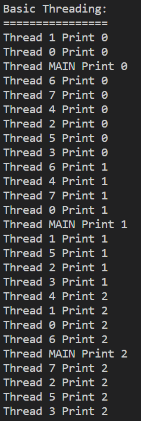
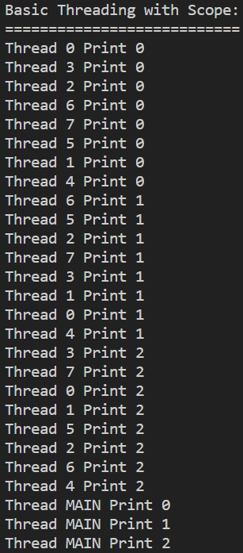

# Threads
Now I will introduce how to explicitly define a thread and give it some work to do. This can be very good for
workloads which are long running and data independent.

This section is somewhat based on [The Book](https://doc.rust-lang.org/book/ch16-00-concurrency.html).
In the last section we looked at what a parallelization library like Rayon can do. Under the hood, it does
quite a lot of stuff. It subdivides a collection, in the examples I showed you, these collections were all
```Vec<T>```, and it then allocates these chunks of the collection to some threads it gets from *somewhere*.
This allows us to create small pockets of parallelism, or if your formulate it slightly differently, even
quite long running programs.

But what if we wanted to control threads explicitly? Each thread might do something differently, do something
long running, only act in reaction to an event or some data being sent, in that case, Rayon might get a bit
confusing, and we don't necessarily want the thread to terminate until the very end of our program.

## What is a Thread
While a process has it's own virtual memory space and is quite heavyweight, processes can't see each others data
very well. [A thread](https://en.wikipedia.org/wiki/Thread_(computing)) is not that. A thread is an execution unit.
If your program is launched as a process (heavy), it has a thread, let's call it the main thread. That thread can
then launch other threads which are contained within the process. Threads can each act independently, but aren't
the same thing as the amount of cores in your CPU. More physical cores on the other hand, do allow you to run
multiple threads in parallel, where as a single physical core can only run multiple threads concurrently.

I really hope that makes sense. You should probably read it again...

Lots of threads are running on your computer at any time. At the time of writing, I can open up Task Manager in
Windows 10 and click the Performance tab too see that I have a whopping 4693 threads and 303 processes running.
The number keeps changing, it won't stand still. I certainly don't have 4693 cores in my laptop.
It is actually 4 cores with 8 logical processors, so if I were to partition my program into N number of
threads, I would probably default to suggest the program to use 8 threads, maybe more.

These threads can execute, wait for a bit, be swapped in and out for other threads. In our programs we can both
have long running threads, which might even be alive for the entire duration of our program, or we can launch
threads whenever we have some additional work to be done. Asking the operating system for more threads is a costly
affair however, think back to memory allocation, any time we ask the operating system for anything it is going to
be expensive. The remedy to this, much like bigger programs keeping memory around to not have it be deallocated,
is to either make a thread pool yourself, or for the library/framework/whatever-you-are-using to maintain a
thread pool. A thread pool is some data structure which keeps a bunch of threads around, keeping them from either
running free or returning to the operating system, to quickly wake them up and give them some work to do, before
they can be returned to the thread pool again.

## Launching a Thread
For this section I have a project ready in ```m2_concurrency::code::threads``` or you can find it
[online](https://github.com/absorensen/the-guide/tree/main/m2_concurrency/code/threads).

Go to the ```basic_threading``` function. In it we launch some threads using the standard libraries
```thread::spawn()``` and give it a closure to execute. Each thread, including the main thread
will print their name in a loop, waiting for a bit after each print. I get the following output -

<figure markdown>
{ width="200" }
<figcaption>
Naively launching 8 threads along with a main thead and printing three times.
This benchmark was run on my laptop boasting an Intel i7-1185G7, 3.0 GHz with 32GB of RAM. The operating system was
Windows 10. The L1/L2/L3 caches were 320 KB, 5 MB and 12 MB respectively.
</figcaption>
</figure>

This is all over the place. Two things to note - the main thread, despite not printing until it has spawned
all of the other threads, prints before some of them. Also, we don't have a handle to any of the threads
after spawning them. Thus we don't have any means of synchronized execution or anything like that.
The threads might still be alive when the main thread is done executing.

## Joining, Wishing, Waiting
Another thing we could do, is to hold on to each thread handle. That would allow us to make sure that
all threads were done before exiting. Go to the function ```basic_threading_with_termination``` and see how that can
done.

<figure markdown>
{ width="200" }
<figcaption>
Launching 8 threads along with a main thead and printing three times. We keep track of the handles and wait for
execution to finish.
This benchmark was run on my laptop boasting an Intel i7-1185G7, 3.0 GHz with 32GB of RAM. The operating system was
Windows 10. The L1/L2/L3 caches were 320 KB, 5 MB and 12 MB respectively.
</figcaption>
</figure>

So we keep the handles for the spawned threads, but at the end we do somethin called ```.join()``` on each handle.
It is one of the simplest synchronization primitives. We just wait for the specific thread we are
joining on to finish executing the function it was given. This is a blocking call, so if that thread has gotten
into trouble, say, an infinite while-loop, we will be waiting on that thread indefinitely. But, we launched
it with a very simple task, so we know we won't be waiting for too long. This is in a way, a manual barrier,
except where with a barrier we could have multiple barriers in a threads program, we strictly wait for that
thread to execute the given code in its entirety. Once it is finished it either rejoins the thread pool
or its execution path joins the main threads execution path.

Now, try and answer the following - why do we do the ```.join()``` calls in that order, and why is the program
correct despite the threads being done with their small programs in random order?

Next, go to the function ```basic_threading_with_scope```. In this function I use the library ```crossbeam```.
It is one of the defacto standard libraries for parallelism in Rust. To launch the threads I use crossbeams
spawner, which lets it keep track of the threads for me.
I then proceeed to use a scope. It is just like the scope we normally have in Rust, but for executing threads
until the end. This is equivalent to the loop of ```.join()```s we just had.

<figure markdown>
{ width="200" }
<figcaption>
Launching 8 threads along with a main thead and printing three times. We use the ```crossbeam::scope``` to enclose
the lifetime of the threads.
This benchmark was run on my laptop boasting an Intel i7-1185G7, 3.0 GHz with 32GB of RAM. The operating system was
Windows 10. The L1/L2/L3 caches were 320 KB, 5 MB and 12 MB respectively.
</figcaption>
</figure>

Note the scope ends before the main thread starts printing. Using a scope is a more automatic way of keeping
track of the lifetimes of our threads.

Ok, so now we know a few ways we can launch some threads and wait until they are done executing, in later
sections I will get into ways you can share data between threads and synchronize.

_________________

## Crossbeam Instead of Rayon
For this section I have a project ready in ```m2_concurrency::code::parallelism``` or you can find it
[online](https://github.com/absorensen/the-guide/tree/main/m2_concurrency/code/parallelism).
Once again, just like in the ```data_parallelism``` section,
we are looking at a homogenous workload in two different versions, a VERY simple version that just doubles
all numbers in a vector and one that does something slightly more complicated, but it is still very
homogenous. Later on you will be asked to look at the presented techniques in a more heterogeneous context
where stuff like work stealing has a much bigger effect.

I will be looking at what happens if we know more about the problem than our library.
We can both help Rayon along to become faster, and use facilities from crossbeam to improve our performance.

So what is it we are doing?

We are just going to split the workload ourselves. ```parallelism()``` contains 2 sections of with a number
of benchmarks each. Each benchmark of the different approaches is hidden behind a flag in ```main()```.
The data is split into chunks, that is a vector of reference slices of size
```chunk_size```. The last chunk will not have the same size as the others.
The first section is the double function and the second section is the slightly more complex functions.
Once again, the workloads are completely homogenous. It should take the same amount of time to execute any
randomly chosen segment of size N, except the last one.
The first benchmark is completely vanilla single threaded execution.
The second benchmark is using Rayon to parallelize the execution of chunks.
The third benchmark is using Rayon to parallelize execution of the original dataset, with no chunks.
This is the normal way we would use Rayon.
Finally, the fourth benchmark uses ```crossbeam::scope()``` to launch ```thread_count``` jobs with low administrative
overhead. To enable these bencharks, set the following flags to ```true``` in ```main()``` - ```single_thread```,
```rayon``` and ```crossbeam_scope```.
Let's look at the results -

<figure markdown>
{ width="600" }
<figcaption>
Launching as many threads as chunks using ```crossbeam::scope``` to enclose
the lifetime of the threads. This is clearly not the way to go, but as the workload becomes bigger,
the performance of launching that many threads becomes slightly better.
This benchmark was run on my laptop boasting an Intel i7-1185G7, 3.0 GHz with 32GB of RAM. The operating system was
Windows 10. The L1/L2/L3 caches were 320 KB, 5 MB and 12 MB respectively.
</figcaption>
</figure>

As you can see, once we chunk our data, leaving Rayon with less administration and scheduling work for its
work stealing paradigm, it actually gets quite good performance compared to crossbeam.

I did not see that coming!

In the next sections I will look at other ways of executing these workloads with crossbeam.
They just require an introduction to mutexes and atomics first.

Finally, try playing around with the amount of chunks, the amount of test iterations and the size of the
dataset. I have a firm suspicion that Rayon does better with more iterations as it probably has a thread
pool running in the back which will be kept alive across iterations or that Rayon, where we do not specify
a number of threads is more free to optimize however it wants.
