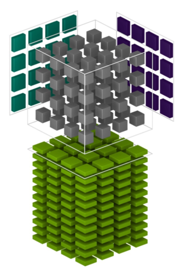

# 🧬 Cooperative Matrices
This is mostly for people interested in deep learning or programming GPUs to the fullest. This should also include
people interested in graphics due to DLSS, denoisers and upscaling becoming so prevalent. Cooperative matrices are
known as tensor cores on Nvidia systems.

Anyways, a GPU is a complex beast, but this section will specifically talk about one area of the chip that was
introduced into the mainstream consumer cards starting with the RTX 20-series. Ironically, the GPU started off as
quite specialized for graphics workloads, as in drawing triangles fast, but was opened up and made increasingly
flexible. With the introduction of tensor cores and ray tracing cores it somehow became both more flexible and more
specialized at the same time. I won't get into the ray tracing cores in this section, but it's pretty awesome!
AMD and Intel systems also have similar functionality.

Cooperative matrices are basically ALU's made for linear operations on small tiles of matrices.
They are really good at multiplying a small matrix by another small matrix and adding another small matrix, while
accumulating the result. It can do it in a number of different levels of precision.

<figure markdown>
{ width="500" }
<figcaption>
Nvidia's visualization of the mathematical operation a tensor core can perform.
<a href="https://developer.nvidia.com/blog/programming-tensor-cores-cuda-9/">
Image credit </a>
</figcaption>
</figure>

While the tensor cores support matrix-matrix multiplication, they are much more limited in the size of the
multiplication. For a general linear operation, you might need to still use loops, but you would then
be tiling your matrix instead, sending a 4x4 tile at a time of your matrices and keep track of your precisions,
such as accumulating in a higher level of precision. You can read more about it [here][0] and for Vulkan [here][1].

If you keep the calculations numerically stable you can even keep all of your weights during the training of
a neural network in 8-bit floating point, while accumulating in 16-bit floating point or greater,
which will greatly reduce the bandwidth needed for training. For inference, it can also yield a big
speedup, especially if you can quantize your weights down to below 8 bits per weight. Remember, that integers
compress better than floating point numbers. So if you do quantization of your entire network before inference,
you can get faster inference and lower power consumption. The cooperative matrix was first available in CUDA,
but has since been made available in Vulkan, although the usage of it is not that wide spread yet as it is a
fairly recent addition and it is still [seeing changes][9] in the API to accommodate emerging usage patterns.

<figure markdown>
{ width="500" }
<figcaption>
Nvidia's visualization of a cooperative matrix.
<a href="https://developer.nvidia.com/blog/programming-tensor-cores-cuda-9/">
Image credit </a>
</figcaption>
</figure>

If you are working with a library like PyTorch and running training on a GPU you might be able to get
PyTorch to make use of tensor cores by using [automatic mixed precision][8]

## Additional Reading
You can check out some material on [tensor cores][2] and [programming tensor cores][3] in CUDA. Or you
can check out [cooperative matrices][4] and [machine learning][5] in Vulkan. There's also some material on  
Accelerating inference [with sparsity][6] and a series of videos regarding how to use tensor cores for
[mixed precision training][7]. A matrix multiplication algorithm, the Okazi scheme, was proposed more than
10 years ago. Now the second version has been published. It uses the Chinese remainder theorem to decompose
matrices into submatrices, optimizing the numerical precision for tensor cores and lower precision. In the
end it achieves greater numerical precision. ✨ [Pure magic][10]! ✨

[0]: https://developer.nvidia.com/blog/programming-tensor-cores-cuda-9/
[1]: https://developer.nvidia.com/blog/machine-learning-acceleration-vulkan-cooperative-matrices/
[2]: https://www.nvidia.com/en-us/data-center/tensor-cores/
[3]: https://developer.nvidia.com/blog/programming-tensor-cores-cuda-9/
[4]: https://registry.khronos.org/vulkan/specs/1.3-extensions/man/html/VK_NV_cooperative_matrix.html
[5]: https://developer.nvidia.com/blog/machine-learning-acceleration-vulkan-cooperative-matrices/
[6]: https://developer.nvidia.com/blog/accelerating-inference-with-sparsity-using-ampere-and-tensorrt/
[7]: https://developer.nvidia.com/blog/video-mixed-precision-techniques-tensor-cores-deep-learning/
[8]: https://pytorch.org/tutorials/recipes/recipes/amp_recipe.html
[9]: https://docs.vulkan.org/features/latest/features/proposals/VK_NV_cooperative_matrix2.html
[10]: https://arxiv.org/pdf/2504.08009
