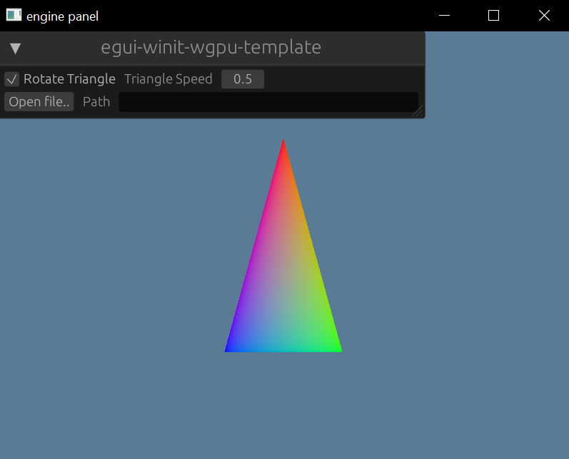

# Graphical User Interfaces
Creating good graphical user interfaces (GUI) is a huge topic on its own, and can be a bit complex. But I
want you to think of the following 3 paths for you. Visualization frameworks, immediate mode and retained
mode. Each of these are entire frameworks that you will have to learn as a tool to use and grow your code
around.

The absolute quickest way to get started is probably to use existing visualization frameworks. They might
not be an exact fit for what you want, and through the lack of limitations (remember, we like limitations),
it might be unable to match the performance of other solutions, and it might be overly complicated for you to
make custom changes. You might get lucky though, and the world class experts who wrote the visualization framework,
might have optimized it like there's no tomorrow, yielding awesome performance. Here's [one such framework][2].

Immediate mode is the type you are most likely to use for learning and prototyping. In the general case, every
single GUI element will be redrawn every single frame. This can take up quite a bit of your performance if you
have a lot of different GUI elements. What you gain instead, is a vastly simpler way of generating your UI.
In most cases, you can get the immediate mode GUI library to render on its own. If you are prototyping a
3D application, it might be a bit tricky to render your own output if you are also in the process of learning
the ropes of graphics programming. A quite nice immediate mode GUI library written in Rust and having WGPU as
a potential backend is [egui][0]. The documentation isn't very comprehensive, but you can find out how to use
the various widgets through the [egui demo][1].

For a small code example, check out the [template][3] I've linked before. The code is too long to
paste here, but it should be fairly easy to see how the widgets are declared in the function ```ui()``` and
results in the following control panel -

<figure markdown>
{ width="300" }
<figcaption>
A GUI element which was easily declared with an Immmediate Mode GUI, egui.
</figcaption>
</figure>

Retained mode, on the other hand, is more complex and will likely involve using a framework enforcing a certain type
of structure in your code. It allows for better performance and is a better tool for GUI's which are user-facing.
What makes retained GUI's faster is keeping track of all of the GUI elements like a tree. Then once an element (A)
needs to be redrawn, all of its child elements (B...) also need to be redrawn. If you have an accumulated image from
drawing the last frame, you only need to redraw all of the pixels where A and children used to be, and all of
the pixels where they will be in the new frame. Some of the most popular retained GUI libraries for Rust are
[Iced][4] and [Dioxus][5].

You can find a [list of GUI-relevant libraries][6].

[0]: https://github.com/emilk/egui
[1]: https://www.egui.rs/#demo
[2]: https://www.rerun.io/
[3]: https://github.com/absorensen/numbers_go_brrrr/blob/main/m4_real_time_systems/code/egui-winit-wgpu-template/src/gui.rs
[4]: https://iced.rs/
[5]: https://dioxuslabs.com/
[6]: https://areweguiyet.com/
