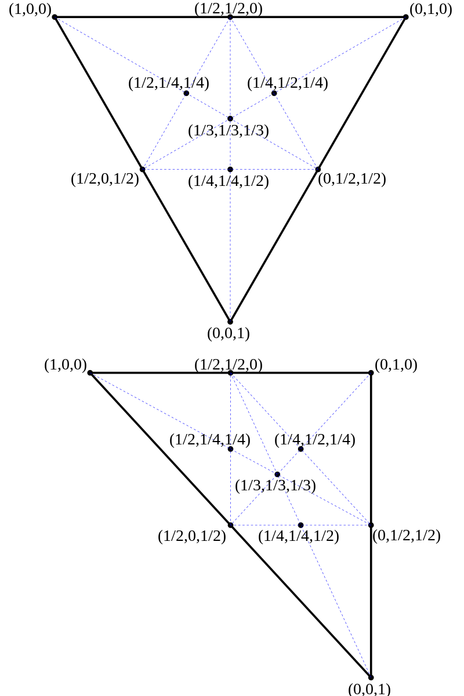
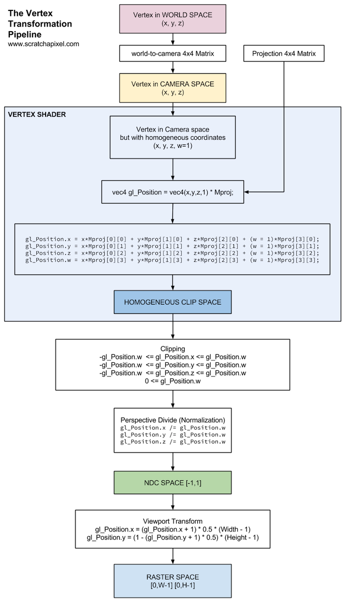
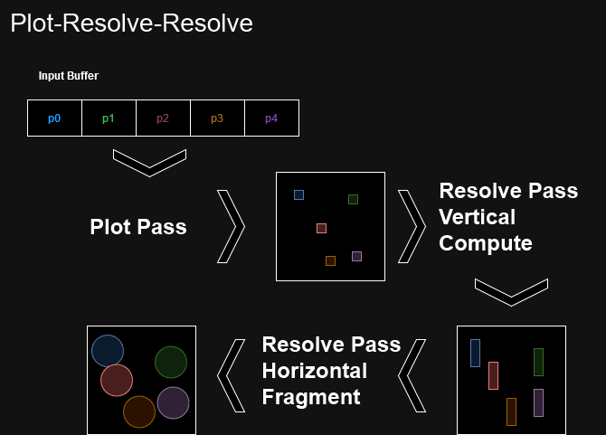

# Graphics in Two Dimensions
In most cases, you can probably get away with some fairly rudimentary code to create, draw and interact
with some buttons for your application. But, in this context, we care about performance. It's simple to
redraw every single button, every single frame, but it isn't necessarily performant. As such, we have to
straddle the line between knowing enough about computer graphics to reason about the performance of GUI's
in interactive systems and not explaining so much that this becomes a full-on graphics course.

So, for this brief introduction to computer graphics, I will try and constrain things to mainly deal with
geometry and 2D rendering without any form of lighting. In the end, I look at what this means in the context
of an immediate mode GUI library like [egui][2] and the accompanying app framework [eframe][3].

## What's in a triangle?
Most of what can be seen on screen is made of two primitives. Lines and images. Lines are a sparse representation,
whereas an image is a dense representation. Lines, aside from their sparsity, have the added side effect that they
are scalable. If we zoom in on an image, densely represented as a two dimensional array of colors, we eventually
zoom in to a point where the image doesn't look very nice anymore. If the image was compressed with a lossy
format such as JPEG, we will also become very aware of unnatural-looking compression artifacts. Lines on the
other hand, can be zoomed in on in perpetuity. This scaling is exemplified by vector graphics formats like PDF and
SVG. There's also other representations such as NURBS, splines and voxels, but they are out of scope.

Back in the before time - when GPU's were really just for graphics... GPU's were made for rendering triangles.
Lots of them. All the time. Triangles are conceptually simple and sparse in nature and we can infer lots of
information from them. GPU's also have helpful hardware support for turning triangles into a bunch of fragments
covering the area of the triangle (rasterization), while matching the resolution of the output image. GPU's
are good at drawing straight (not curved!!!) lines and images. Which we will get back to later on, when I
take you through what goes into rendering a UI.

The most commonly used definition of a triangle is three vertices and three edges. The vertices are the
corners of the triangles and the edges are the lines between them. One key observation can be made though.
We can define the triangle instead by an ordering. If we define just the three vertices, we have also
defined a triangle because we implicitly assume that all three vertices are in the same triangle. However,
in graphics and geometry, it is really important to know which direction of a triangle's surface is
facing outwards. What is commonly seen, is that triangles have their faces defined by the ordering of the
vertices and whether the face is constructed in clockwise or counterclockwise fashion. You might ask
yourself why this is important. For one, this allows us to determine whether we are inside
or outside a surface/volume and it allows us to not render the backface of triangles. Without it we would have to
render each triangle twice as we aren't allowed to assume the two faces match. If you think about something like
the impact of lighting, having the same lighting whether something was facing towards or away from a light source,
would be completely inconsistent with the world we think we know.

<figure markdown>
{ width="600" }
<figcaption>
Each vertex is given a color. Each fragment has its color interpolated by the GPU.
<a href="https://en.wikipedia.org/wiki/Barycentric_coordinate_system">
Image credit </a>
</figcaption>
</figure>

Triangles can have auxiliary data like normals, UV coordinates, color, material (might be defined per draw call)
and anything else you might think of. This auxiliary data is most often defined per vertex and interpolated between
to generate smooth values across the triangle face. Normals are directional vectors representing which way a
surface is pointing. If we give vertices A, B and C their own normal each, despite a vertex not having a real normal,
most GPU's would find the barycentric coordinates of a given fragment of the triangle face and use it to construct
a new normal.

<figure markdown>
{ width="600" }
<figcaption>
Phong shading, using interpolated normals to change the lighting per fragment.
<a href="https://en.wikipedia.org/wiki/Phong_shading">
Image credit </a>
</figcaption>
</figure>

Barycentric coordinates means finding a given position in the triangle's own 3D space where all values
are between 0 and 1 and the sum of the three values is always 1.

<figure markdown>
{ width="600" }
<figcaption>
Barycentric coordinates for triangles.
<a href="https://en.wikipedia.org/wiki/Barycentric_coordinate_system">
Image credit </a>
</figcaption>
</figure>

UV coordinates are coordinates into a texture (image) which allows us to wrap a bunch of triangles
(mesh) in an image. You can also render a simple rectangle, which is just two triangles, and have
its surface colors be from a texture. For example, we might like to render a 2D button in a 3D world.
In which case we might render a 3D rectangle and use UV coordinates to look up values in a texture.

## What's in a series of triangles?
Usually when we deal with more than a handful of triangles, we are talking meshes. Or more accurately,
[polygon meshes][9]. We have a bunch of vertices and edges, which make up a lot of faces, which share borders.
Note that a mesh isn't necessarily completely connected, you can have islands of smaller meshes floating around
somewhere. This is usually not a good thing. Especially if those outliers are far from the main attraction.
Generally, these meshes aren't just randomly interconnected but make up some nice watertight surfaces wherein
faces don't cross. Not having faces which cross is part of what can make a mesh [manifold][10] or non-manifold.
From this point on, just assume that I am always talking about manifold polygonal meshes.

Once we move away from merely describing handfuls of triangles we should, as we always should when scaling things,
make sure that we don't naively reuse too much information which could either be described once, or inferred.
Part of this optimization is performed by recognizing that in a mesh, a lot of vertices occur as part of more than
one face. In fact, in most meshes a vertex will occur in an average of just around six faces. A vertex is likely
to cost anywhere between 2 or 3 times 16- to 32-bits, depending on whether the mesh is 2D or 3D. 6 entries of
the same vertex would cost us 196- to 576-bits. Where as if we instead used a 16-bit integer to represent an
index into a list of vertices, we could describe the same vertex six times with 32 to 96 bits for the
core description, and 72 bits for the indices, for a total of 104 to 168 bits, saving us 1.88x to 3.42x
depending on the dimensionality of the data. The savings will of course be greater if we also have auxiliary
data for our geometry, such as normals, UV coordinates and color. The cost of austerity in this case is a layer
of indirection, which is why when we call a graphics API to draw triangles we can draw them with or
without indices. Usually there will be a function called ```draw()``` and ```draw_indexed()```.

```draw()``` will work from a vertex buffer, which is just an array of all vertices and their
attributes. How to interpret the vertex buffer(s) has to be specified before usage. These attributes can either be
interleaved, as in ```x0y0z0r0g0b0x1y1z1r1g1b1``` or be split by type
```x0x1..xNy0y1..yNz0z1..zNr0r1..and..so..on..```. The last one can also be advantageous for compressing the data.
When using ```draw_indexed()``` we have another buffer, called the index buffer, which indexes into the vertex
buffer. Naively, we could simply interpret every three vertex indices as being a triangle face. As I wrote earlier,
this would be interpreted either in clockwise or counterclockwise fashion. But, depending on the GPU API you are
using, a number of different primitive interpretations might be available.

<figure markdown>
{ width="600" }
<figcaption>
Geometric primitives in OpenGL.
<a href="https://www3.ntu.edu.sg/home/ehchua/programming/opengl/CG_Introduction.html">
Image credit </a>
</figcaption>
</figure>

The point primitive is sometimes available. It will usually draw a quad (rectangle) with a size you have to set
per vertex. The most used are usually lines, triangles and triangle strips. When we know we have a contiguous
set of triangles, we can save a lot of indices by using a moving window interpretation for the faces. Face 0
will be vertex 0, 1 and 2, face 1 will be vertex 1, 2 and 3 and so on. To stop the strip and start a new one,
you can usually make the strip degenerate by repeating a vertex. So making face 1 be vertex 1, 2 and 2, would
make it clear that a new triangle strip needs to be started. Sometimes to maximize numerical accuracy or to
help with the quantization process, we might create a model matrix for the mesh and normalize all coordinates
to maximally touch the surface of a unit sphere and then quantize to lower precision integers. This effectively
moves the values of the coordinates from model space (please don't define your geometry in world space), into
a normalized/quantized model space.

## What's in drawing a series of triangles?
Now we have a mesh to draw. How do we draw it? First of all, just like when we looked at the more generic
GPGPU programming in ```m1```, any time we want data on the GPU, we have to allocate and transfer. For vertex
data, it is the exact same. We have to allocate a buffer on the GPU and transfer data from the CPU in a format
that works for the GPU. If you update the vertex data you should reuse the buffer to avoid another allocation
or use a handful of buffers you can switch between. If you want to redraw the same model, don't reallocate
and retransfer, just reuse. If you can avoid any allocations and transfers, you should.

Once the vertex buffer has been properly described, allocated, transferred and received, we can start using
it on the GPU. There are more possible variations of the drawing process, but here is a basic version from
[earlier][11] -

<figure markdown>
{ width="700" }
<figcaption>
A simplified view of the traditional vertex/fragment shader setup. The geometry shader
is optional and not that popular anymore.
<a href="https://learnopengl.com/Getting-started/Hello-Triangle">
Image credit </a>
</figcaption>
</figure>

When we call the correct draw function with the properly created and bound render pipeline, a traditional
vertex and fragment shading pipeline might look like above, minus the geometry shader, which has fallen out
of favor. So, we send all of the data we want to draw through the vertex shader. Each instance of the vertex
shader gets a single vertex to process. Often it might have global associated data, such as various transformation
matrices which can be applied to each vertex, such as taking into account moving the mesh around in world space
or taking into account where the camera actually is. If you have quantized coordinates, such as 16-bit
signed integers, this would also typically be where you would dequantize these values and get floating point
coordinates.

Once the vertices are through being processed in the vertex shader, they are sent to shape assembly. This
is where the geometry primitives result in a shape, such as a line or triangle, are assembled. Once the
shape is assembled, culling can take place. If a triangle is completely outside the field of view of the camera,
there is no need to use more compute on it and it can be discarded. If it is partially or wholly within the view
frustum (box which contains all the camera can see), the primitive can be rasterized. The surface of the primitive
is sliced and diced into fragments. For primitives only partially within view, the fragments what are wholly outside
can safely be discarded. This is called clipping.

The surviving fragments are sent to the fragment shader. In the fragment shader, you can do all sorts of coloring
and lighting. But we can also change the depth of the fragment (more on that in a few lines) and even discard the
fragment. This can be really useful if we want to draw circles (also more on that later). Meshes are really
expensive if you want to draw a nice round circle. You have to generate enough vertices to match the resolution
of the image to get something that might look like a real circle. What you can do instead, is to draw circles
as a single quad (two triangles) and keep track of the center point and radius. For each fragment you can
discard the fragment from the quad if it is outside of the radius. Voila. You just drew a much cheaper circle.
This could also be used for drawing rounded corners on otherwise square rectangles.

Once we have done what we needed with the fragments they are sent for testing and blending. In traditional
rasterization-based graphics, we render to a framebuffer. A framebuffer consists of an image in one or more
colors, a depth buffer and auxiliary information. The depth buffer is a (usually log compressed) image
containing depth values. Fragments which are passed on from the fragment shader are tested against this
depth buffer. Depending on how you set up your system, it will discard or accept new fragments replacing
the currently held fragment. A small example; if we submit a new fragment for pixel (3, 4) with depth value
0.1, and the currently closest (to the camera) fragment has a depth value of 0.3, the new fragment will replace
the current one. As such, the depth value will be updated and the other image, which is the one which
we will eventually present to the screen, will have the color in pixel (3, 4) replaced with this new
fragment as well. There is a slight bit of complexity to this as fragments can have an alpha value,
which determines its opacity. If alpha blending is enabled, the new fragment might be mixed in with the
current value. If you think about the various windows in your operating system, quite a few can be made
transparent. Which requires that we don't completely overwrite former values, but blend in the new ones.
This also requires that we sort all the elements we are rendering from back to front in what is called the
[Painter's algorithm][12]. If you don't feel this algorithm intuitively, just go to YouTube, type in Bob Ross.
Find any video. They're all good. Then set a timer. The timer is very important. If you don't set the timer
eventually you will float away in an ocean of serenity. Set the timer and come back to this website. You
need to finish what you started!

The reverse of the painter's algorithm is more efficient, so don't do it unless you need to. Writes are
generally more expensive than reads, and that is also true in the process of proposing new fragments
and testing them against the depth buffer. If we could only write to every single pixel once, and then
have all other fragments rejected, while still getting the correct image, that would be quite a bit
more efficient. This goes back to contention which was introduced in both ```m1``` and ```m2```.

Once all elements have been rendered, the image part of the framebuffer can be presented to the screen.
The framebuffer used in the last frame can be used to render the next frame. At the beginning of that
render process, the new framebuffer will have its former values cleared.

One rendering concept which I have largely ignored until this point is coordinate spaces.
The geometry we put into our vertex buffers at the beginning are of course not defined relative
to the world it exists in. It is defined independently. To move it about, we don't change the
value of every single vertex, we change a model matrix which moves the model about in the world.
Usually, that world space will be centered around the camera. When we move the camera throughout
the world, we are actually moving the world and not the camera.

<figure markdown>
{ width="700" }
<figcaption>
We just have to realize that there is no spoon.
<a href="https://www.matrixfans.net/there-is-no-spoon-spoon-boy-actor-rowan-witt/">
Image credit </a>
</figcaption>
</figure>

If you think back to ```m3``` and what I wrote about the precision of floating point numbers,
this should make sense. By keeping the world centered around the camera and moving everything
else, the elements that are close to the camera (0.0) have a higher numerical precision and the things
that are far away have a lower numerical precision. To get from the world space to the camera's space,
also known as view space, another matrix is involved; the view matrix.

<figure markdown>
{ width="700" }
<figcaption>
LearnOpenGL's explanation of the coordinate spaces in the vertex/fragment render pipeline.
For a more detailed coordinate system explanation follow the link.
<a href="https://learnopengl.com/Getting-started/Coordinate-Systems">
Image credit </a>
</figcaption>
</figure>

Now we are seeing things from the cameras perspective and we can take into account the projection
of the camera with the projection matrix. Now we should be in clip space, which resides in 2D from
-1.0 to 1.0 for both axes. Once the primitives have been culled, clipped and rasterized, we are in
normalized device coordinates. In GUI libraries you might see something called NDC. This is it.
If you are rendering GUI elements, which are always in the same place, you can circumvent all of
these matrices and define your geometry directly in normalized device coordinates. Once the fragments
are passed through the fragment shader they are moved into screen space which translates them directly
to the actual pixels they correspond to.

<figure markdown>
{ width="600" }
<figcaption>
Scratchapixel's explanation of the coordinate spaces in the vertex/fragment render pipeline.
For a more detailed coordinate system explanation follow the link.
<a href="https://www.scratchapixel.com/lessons/3d-basic-rendering/perspective-and-orthographic-projection-matrix/projection-matrix-GPU-rendering-pipeline-clipping.html">
Image credit </a>
</figcaption>
</figure>

## What's in drawing a series of triangles for a GUI?
Now we've gotten to the point where we can draw triangles, but we would like to draw them. Note that interaction
and drawing GUIs might result in one changing the other, but figuring out which GUI element the mouse clicked
isn't part of rendering. In fact, in order to figure out which element was clicked by a mouse, we might instead
use bounding boxes around elements to quickly figure out which was clicked, but this can be done and optimized
in lots of different ways. Anwyways, let's look at some issues in rendering GUI's.

If we weren't to do the easy thing and pregenerate every button into textures which we would just render (and be
unable to scale past the maximum texture resolution) we could try to either try to create a mesh to represent a
button, which is fine if the button is just a rectangle. But as soon as we start craving hedonistic concepts such
as curved lines and rounder corners (*audible gasp*) we would have to use an astronomical amount of geometry
(vertices and faces) to represent what otherwise seems so simple. We could try and match the amount of geometry
to the resolution of the screen by tesselating the mesh representing the button whenever the size of the screen
changed, but this is quite expensive, and it is just a button. Tessellation is when we take a base mesh and add
more vertices and faces to get a new "higher resolution" mesh.

<figure markdown>
{ width="600" }
<figcaption>
<a href="https://en.wikipedia.org/wiki/Tessellation_(computer_graphics)">
Image credit </a>
</figcaption>
</figure>

It's a complex topic so just make this connection - tessellation is expensive, but results in more details.
It is also loosely connected with [subdivision surfaces][4], also described in greater detail by [Pixar][5].

This leaves us in a bit of quandary. If we wanted to draw a circle ourselves, such as allowing a user to draw
on a canvas and representing each drawing as a circle, every single frame we would get in a signal of where the
mouse was placed and whether the left mouse button was pressed. The drawing would be monochromatic, meaning we
wouldn't need to care about the order in which elements were drawn. It would also only have two colors, completely
white or completely black. It is also assumed that the drawing canvas has a limited resolution, like 50x50. The
drawing could then be fed an image classifying neural network, such as an MNIST classifier. How would we
represent that?

### Naive Circles
The naive approach would be to keep a vertex buffer of circles created with enough vertices to draw a fairly
round circle. We can add another circle's worth of vertices to the vertex buffer every time we get a
left button pressed signal. We will end up with a lot of waste though. Circles will overlap, and there will be
a signficant amount of contention around some pixels in the depth buffer. We are also using way more vertices
than we need and doing a significant amount of updating in the vertex buffer, which will likely result in more
allocations being needed.

### Point (Primitive) Break
Another strategy could be to use the points primitive instead and only put a single point per primitive into
the vertex buffers. We could then set the size of the points (quads) to be drawn to match our needs and pass
the desired radius of the circles as a uniform. A uniform in a graphics context is a global variable that we
can access from shaders. Every shader invocation gets the same value and it is read-only. The radius uniform
could be used to discard fragments outside of the center position of the circle. Now we have a significantly
smaller amount of vertices, but we need to do some extra lifting in the fragment shader and pass more information
(center of the point) from the vertex shader to the fragment shader. Also, not all graphics API's have the
points primitive. Another thing we could do would to just pass actual quads in and use the radius to discard.

### Plot Resolve Resolve
One thing we could do instead is to remove the vertex shader altogether and create a new pipeline. For this one
we will use a new setup consisting of two compute shaders and a fragment shader in a plot and double resolve setup.
For this version you can just put the center points into an input buffer, but you could also add a level of
quality by adding a radius per point in order to indicate the amount of pressure applied when drawing. Compute
shaders don't care about concepts like vertex buffers. Generic array is what is used. The compute shader itself
has to interpret what the contents mean. In that case you would have ```x0y0r0``` for every circle to
draw. Anyways, I'll just assume a universal radius.

<figure markdown>
{ width="768" }
<figcaption>
A diagram of using two compute shaders and a fragment shader to plot and then resolve (expand) points into circles.
</figcaption>
</figure>

The first step is to launch a thread for every point in the input buffer (scattering). In this case we don't
care about depth, so we don't need to construct a new integer value and do a combined value representing the
color and the depth. Instead we just need to note the presence of a center in a 2D array representing the
canvas. This canvas should be cleared before we begin. Once all points have had their center written to the
2D array in a correct fashion, we can move on to the two resolve steps. The resolve steps will both have
the gathering view point. We could do both of these in compute, but we also need to present the canvas to
screen. Both the last compute shader and the fragment shader will do the same thing, however. The first
compute shader will have each thread taking the point of view of a new 2D array and search in an N pixel
radius up and down. The second resolve step will again take the point of view of each pixel in the output
2D array, but look in the horizontal direction and then output its value to the framebuffer, which can then
be presented to screen.

### Progressive Rendering
Two optimizations left!

In the previous setup we cleared the framebuffer every frame and rerendered all points every frame. We don't
actually need to do that. We can simply decide to keep the points rendered in the buffers until a "clear canvas"
button has been pressed. At this point our rendering isn't all at once, but becomes additive instead. We can now
keep a smaller buffer and send along a uniform which tells the shaders how many elements in the input buffer
are to be rendered. Now we no longer reuse points and the buffer goes to 0 active elements every frame.

One hickup you have to keep track of with this setup is the swapchain. We doh't present the same image to screen
every frame. We have a special set of images we are allowed to present to the screen. If we have two images
in our swapchain the screen will be showing image A, while we are rendering to image B. Once we are done
with image B, we present image B to screen and image A becomes available for us to render to. This also means
that when we don't clear our output image every frame, we cannot use the swapchain images for this. We would
alternate between rendering to the two images. Some points would be rendered to image A and some points to image B.
Instead we need to keep our accumulated image in a buffer which can then be copied from to the current swapchain
image.

### The Most Unnecessary Point
A lot of this moderately advanced rendering stuff is actually sort of redundant.
We can massively reduce the amount of work done by keeping track of which points have currently been drawn,
and then not redrawing them. We can do that on the CPU and it is quite easy to do. Or at the very least, we
can recognize that the screen and the mouse events might come in a lot faster than the user might be moving
their mouse. We can put in a simple check. If the left mouse button is pressed and the new point is the same
as the old point, we can just do nothing. We don't need to rerender to the screen, the image will stay up,
we don't need to launch a bunch of shaders either.

Another option would be to keep track of the output pixels on the CPU with a plot/resolve setup and 2 2D
arrays. In that case all new points could be written to the plot buffer and then for each pixel in the resolve
buffer a surrounding area limited by the radius could be searched for a relevant pixel to make into a circle.
This should be fairly easy to parallelize with something like Rayon.

What is best in this case depends on how much time you have to implement it, the CPU version being much faster
to implement, and where you want to run the MNIST classifier. If you do it on the CPU, you can save the transfer and
synchronization by doing it on the CPU and sending a copy of the pixels directly to the GPU to copy into the
screen buffer image. If you are running inference on the GPU, having the GPU accumulate the buffer might be
quicker. Especially, if the resolution of the canvas scales beyong 50x50 pixels.

This was a non-exhaustive list of ways to accomplish drawing circular lines on a canvas, there are of course
more ways, but this was already fairly wordy.

We can also find a simpler way to do things by relinquishing fine-grained control and use an app framework
made for egui, called [eframe][15]. You can find a Hello World example [here][6]. Which significantly
shortens the time it takes to get some buttons on screen

## Additional Reading
[Bresenhams line algorithm][7] is a classic algorithm for drawing lines across pixels.
[Xiaolin Wu's line algorithm][8], while more expensive, draws nicer lines. [Anti-Aliasing][14] is a core topic
in graphics and can massively influence how nice your rendering looks. You can read more about
[how to draw rounded corners][13] on StackExchange.

If you would like to know more about classic rasterization based computer graphics using GPUs, I can recommend the
websites [LearnWGPU][0] and [LearnOpenGL][1] for the one thousandth time.

[0]: https://learnopengl.com/
[1]: https://sotrh.github.io/learn-wgpu/
[2]: https://github.com/emilk/egui
[3]: https://github.com/emilk/egui/tree/master/crates/eframe
[4]: https://en.wikipedia.org/wiki/Subdivision_surface
[5]: https://graphics.pixar.com/opensubdiv/docs/subdivision_surfaces.html
[6]: https://github.com/emilk/egui/blob/master/examples/hello_world/src/main.rs
[7]: https://en.wikipedia.org/wiki/Bresenham's_line_algorithm
[8]: https://en.wikipedia.org/wiki/Xiaolin_Wu%27s_line_algorithm
[9]: https://en.wikipedia.org/wiki/Polygon_mesh
[10]: https://en.wikipedia.org/wiki/Manifold
[11]: https://absorensen.github.io/the-guide/m2_concurrency/s6_more_gpu/
[12]: https://en.wikipedia.org/wiki/Painter's_algorithm
[13]: https://computergraphics.stackexchange.com/questions/10994/how-are-rounded-corners-of-user-interfaces-usually-rendered-in-modern-applicatio
[14]: https://learnopengl.com/Advanced-OpenGL/Anti-Aliasing
[15]: https://docs.rs/eframe/latest/eframe/
